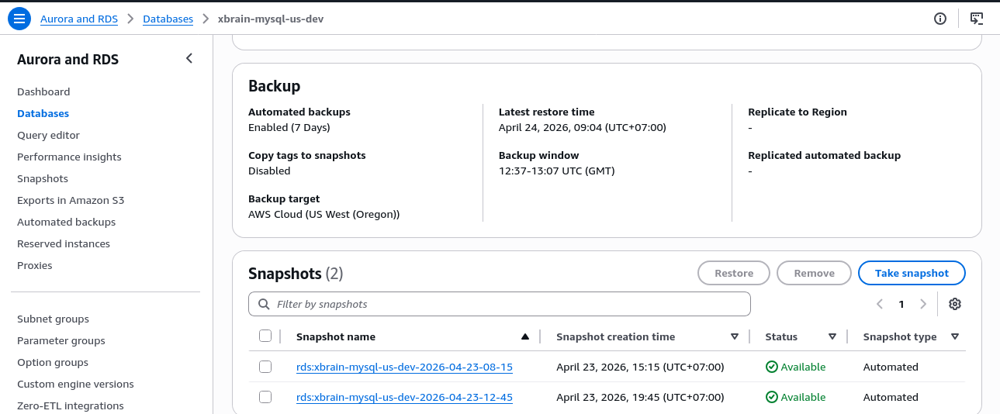
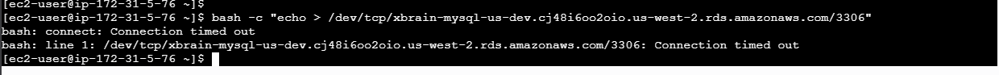
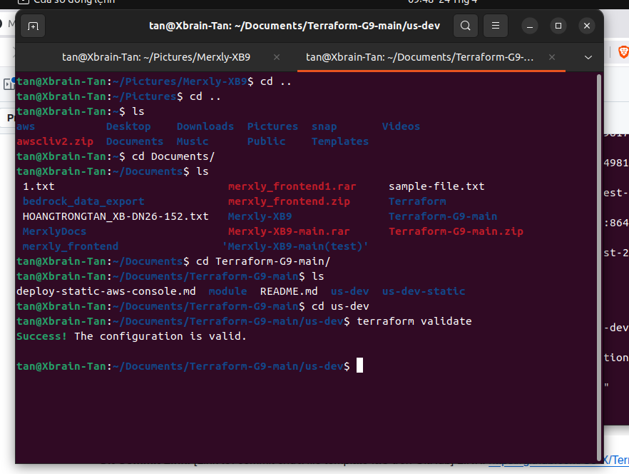
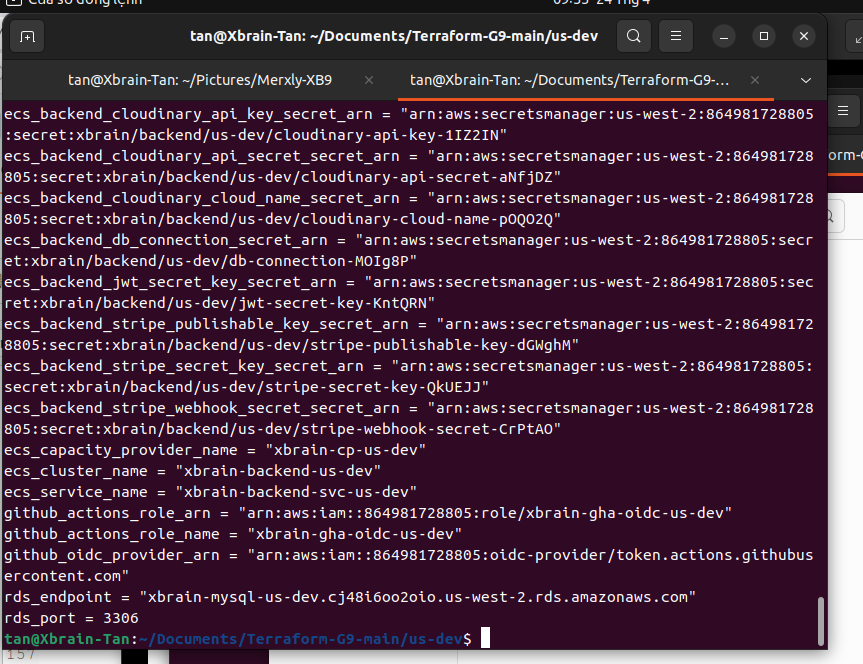
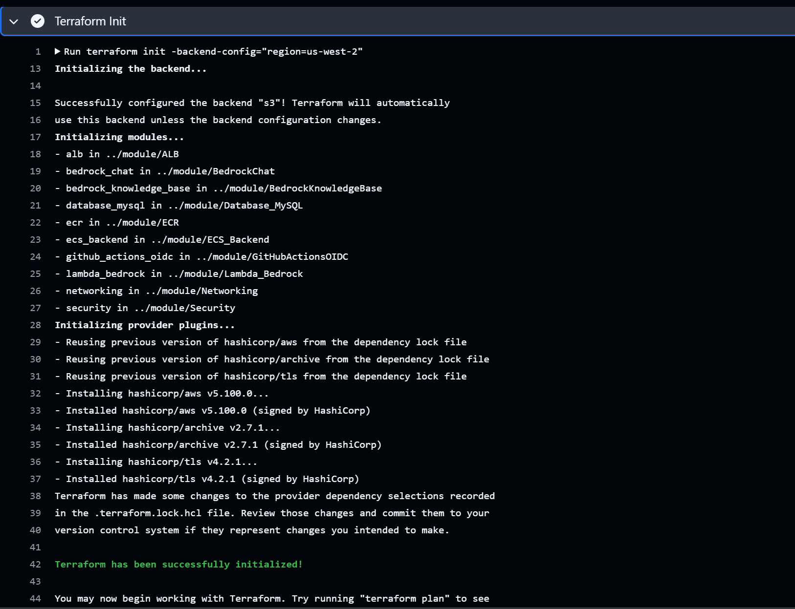
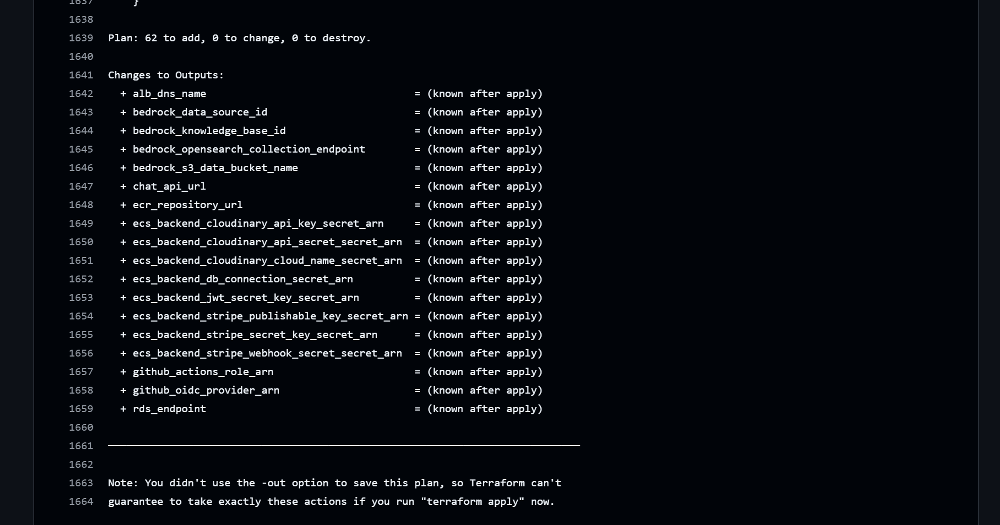

# Evidence Pack — Week 3
## (1) Cover
* **Group Name:** G9-X (Merxly)
* **Members:** 
  - Lê Hoàng Trung Kiên
  - Trần Văn Đức — Team Lead 
  - Nguyễn Đức Chinh
  - Phạm Nguyễn Nam Khánh
  - Hoàng Trọng Tấn
  - Trương Thị Mỹ Quyên
  - Trần Đình Bảo Long
  - Lê Duy Khánh
  - Nguyễn Hữu Định
* **Database Engine:** Amazon RDS for MySQL
* **Database Paradigm:** Relational Database

---

## (2) Data Access Pattern Log

### Part A: Application Workflow
*(Mô tả các luồng truy cập dữ liệu chính của ứng dụng. Ví dụ: Người dùng vào xem sản phẩm, người dùng đặt hàng, cửa hàng xem thống kê...)*

1. **Pattern 1 →**
Browse sản phẩm theo category — customer vào trang category, filter theo IsActive=true, sort theo CreatedAt DESC, phân trang 20 items/page, ~200 calls/ phút

2. **Pattern 2 →**
Đặt hàng (checkout) — 1 request ghi atomic vào 4 bảng: Orders (1 row) + SubOrders (N rows, 1/store) + OrderItems (M rows) + Payments (1 row) trong cùng 1 transaction, ~30 calls / phút

3. **Pattern 3 →**
Order history của customer — customer xem lịch sử đơn hàng, JOIN Orders × SubOrders × OrderItems × Products để hiển thị tên sản phẩm + số lượng + giá, ~80 calls / phút


### Part B: Query Specifications
*(Mô tả các câu query hoặc thao tác dữ liệu cụ thể dùng để đáp ứng các Workflow ở Part A)*

Pattern 1 — Browse sản phẩm theo Category
Engine: RDS MySQL / Relational

Cơ chế: Dùng composite index IX_Products_CategoryId_IsActive_MinPrice → MySQL đọc thẳng trên B-tree, không scan toàn bảng

Kết quả đo được: type=ref, rows=1, filtered=100%

Hiệu quả: O(log n) thay vì O(n)

Pattern 2 — Checkout / Đặt hàng
Engine: RDS MySQL / Relational

Cơ chế: ACID Transaction qua 4 bảng:

START TRANSACTION
→ INSERT Orders → SubOrders → OrderItems → Payments
→ COMMIT  (hoặc ROLLBACK nếu lỗi)
FK constraints enforce integrity ở database level

Hiệu quả: Payment fail → rollback toàn bộ, không bao giờ có order thiếu items. InnoDB row-level locking cho phép nhiều user checkout song song

Pattern 3 — Order History của Customer
Engine: RDS MySQL / Relational

Cơ chế: JOIN 4 bảng, filter bằng IX_Orders_UserId trước → nested loop join xuống SubOrders → OrderItems → Products qua primary key

Hiệu quả: Chỉ scan orders của 1 user, không đụng đến hàng triệu rows còn lại


### Part C: Schema / Data Model

Chọn Pattern 2 (Checkout) — nếu dùng DynamoDB (key-value paradigm) thay vì RDS MySQL:
DynamoDB không có ACID transaction thật sự — nếu ghi Payment thành công nhưng OrderItems fail, hệ thống sẽ có payment đã trừ tiền nhưng order không có items, và không có cơ chế rollback tự động để hoàn tiền. Với Merxly là marketplace thu tiền thật, corrupt kiểu này là không chấp nhận được. RDS MySQL InnoDB đảm bảo all-or-nothing — payment chỉ được commit khi toàn bộ 4 bảng ghi thành công.

---

## (3) Deployment Evidence
*(Mỗi acceptance criterion 1 entry với hình ảnh console/CLI kèm theo 1-2 dòng notes giải thích lý do cấu hình)*

### Criterion 1: Database Provisioning


> **Note:** We configured RDS MySQL with `multi-az=true` and a specific instance class to ensure high availability and right-sizing for our development environment.

### Criterion 2: Security & Encryption

> **Note:** Storage encryption is enabled using AWS KMS to ensure all persistent data is encrypted at rest.

### Criterion 3: Backups & Maintenance

> **Note:** Automated backups are enabled with a retention period of 7 days to allow for Point-In-Time Recovery in case of accidental data loss.

---

## (4) Working Query Evidence
*(1 operation phù hợp với paradigm - ở đây là Relational JOIN, kèm theo kết quả `EXPLAIN` để show index)*

Screenshot 1 — Configuration (Encryption + Multi-AZ)
Encryption: Enabled với AWS-managed KMS key (aws/rds). Chọn AWS-managed thay vì customer CMK vì không có compliance mandate và muốn automatic key rotation. Multi-AZ: Yes với Secondary Zone us-west-2a — nếu primary (us-west-2b) fail, RDS tự động failover mà không cần manual intervention.


Screenshot 2 — Maintenance & Backups
Automated backups: Enabled (7 Days) — đủ để point-in-time restore về bất kỳ thời điểm nào trong tuần qua. Latest restore time: April 24, 2026 01:24 UTC+7 xác nhận backup đang hoạt động. Có 2 automated snapshots available làm safety net bổ sung.




---

## (5) Lambda + Bedrock Evidence
*(Bằng chứng tích hợp Lambda với Amazon Bedrock - Không dùng kết quả chụp từ Playground)*

**CloudWatch Logs (Lambda Execution):**

> **Note:** This log entry confirms the Lambda function successfully invoked the Bedrock model via the AWS SDK.

**Bedrock API Response:**
```json
{
  "completion": "Đây là kết quả trả về từ Amazon Bedrock...",
  "stop_reason": "stop_sequence"
}
```

---

## (6) VPC + Networking Evidence
*(Bằng chứng về bảo mật mạng: Route table có S3 Gateway Endpoint & Inbound rule của Database Security Group)*

**Database Security Group Inbound Rule:**


> **Note:** The RDS security group restricts inbound traffic on port 3306 exclusively to the Backend Application Security Group, denying all direct public access.

**VPC Route Table (S3 Gateway Endpoint):**

> **Note:** We configured an S3 Gateway Endpoint in the route table so that our backend can interact with S3 buckets internally without sending traffic over the public internet.

---

## (7) Negative Security Test
*(Bằng chứng về việc hệ thống từ chối truy cập trái phép)*

Test 1: Một EC2 được sử dụng để thử kết nối TCP đến endpoint Amazon RDS MySQL qua cổng 3306 bằng lệnh socket. Kết nối đã bị Security Group chặn và dẫn đến timeout, xác nhận truy cập trái phép không được phép.




Test 2: EC2 thử kết nối tới RDS MySQL qua SSL nhưng bị lỗi 2003 (connection failed), cho thấy không thể truy cập tới database endpoint.

> **Note:** We attempted to connect directly to the RDS instance using MySQL Workbench from a public IP address. The connection timed out / was rejected because the instance is in a private subnet and the Security Group does not allow external IP addresses.

---

## (8) Bonus (Optional)
*(Nếu team có làm CloudFormation / Terraform thay vì click Console)*

* **Template Validation Output:**
  ```bash
  terraform validate
  # Hoặc aws cloudformation validate-template ...
  
  ```
  
 
  
  
  

  
  Terraform validate on Github
  
  Terraform plan on Github
* **Git Commit Link:** [Link tới commit chứa file template IaC trên GitHub]
LINK: https://github.com/G9-X/Terraform-G9
