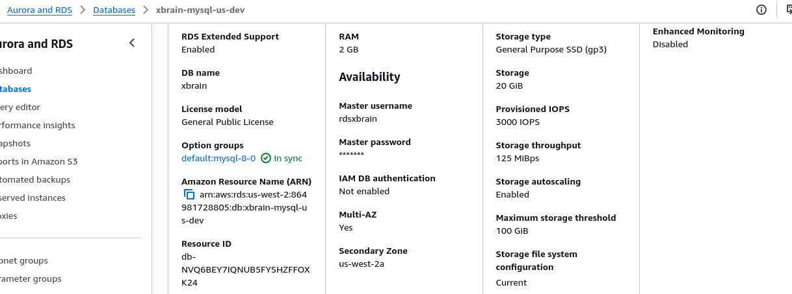
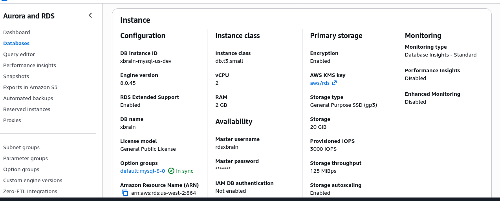
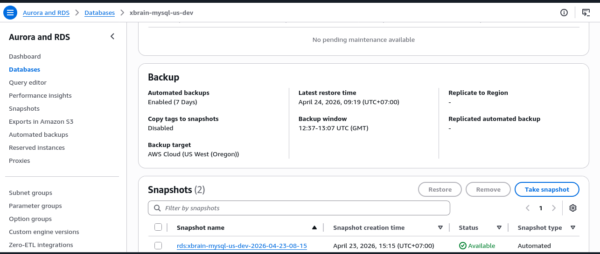
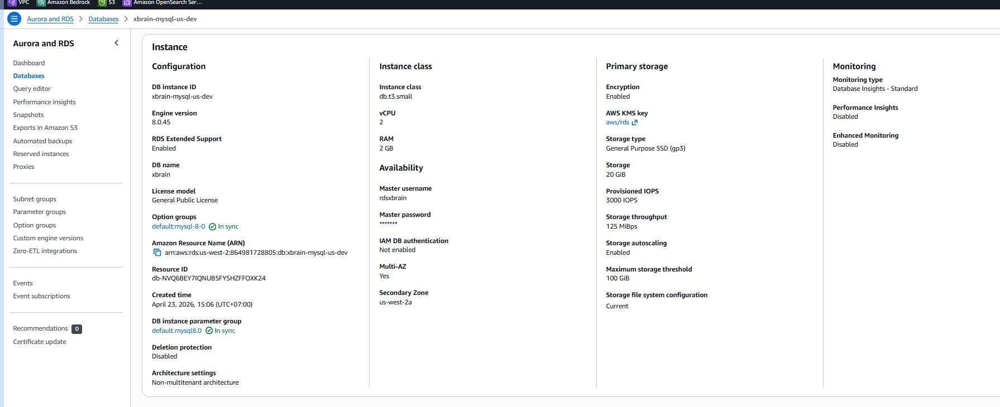
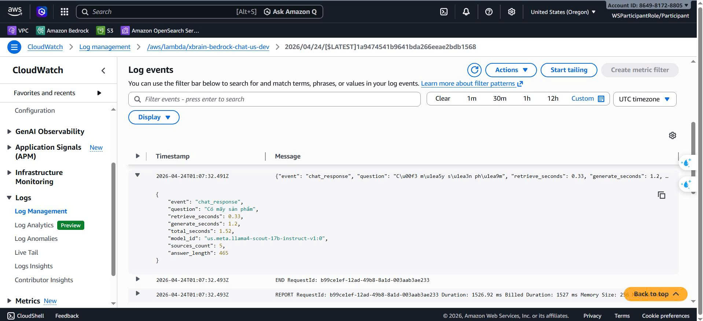
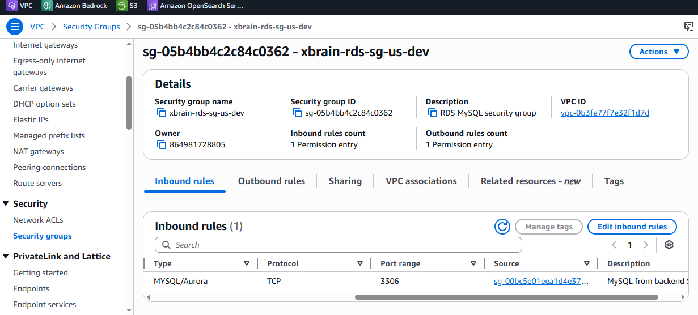
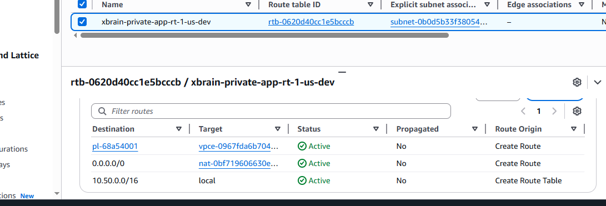
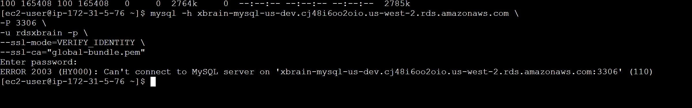

# Evidence Pack — Week 3
## (1) Cover
* **Group Name:** G9-X (Merxly)
* **Members:** 
  - Lê Hoàng Trung Kiên
  - Trần Văn Đức — Team Lead 
  - Nguyễn Đức Chinh
  - Phạm Nguyễn Nam Khánh
  - Hoàng Trọng Tấn
  - Trương Thị Mỹ Quyên
  - Trần Đình Bảo Long
  - Lê Duy Khánh
  - Nguyễn Hữu Định
* **Database Engine:** Amazon RDS for MySQL
* **Database Paradigm:** Relational Database

----

## (2) Data Access Pattern Log

### Part A: Application Workflow
*(Mô tả các luồng truy cập dữ liệu chính của ứng dụng. Ví dụ: Người dùng vào xem sản phẩm, người dùng đặt hàng, cửa hàng xem thống kê...)*

1. **Product listing by category/filter/sort** 
— Users browse category pages and retrieve active products by `category`, optional `price range`, and sort by newest or price 

2. **Place an order (checkout)**
  — Users submit checkout, and the system creates an order, inserts order items, updates stock in `ProductVariants`, and records payment state

3. **Order history for one user**
  — Users open **My Orders** to fetch all their orders sorted by latest date, then view order details

### Part B: Query Specifications
*(Mô tả các câu query hoặc thao tác dữ liệu cụ thể dùng để đáp ứng các Workflow ở Part A)*
1. **Pattern 1 →** RDS MySQL `Products` table, indexes on `CategoryId` and `(CategoryId, IsActive, MinPrice)`
   — Filter by category + active status, then range scan by price  
   — Supporting index on `CreatedAt` for sort by newest

2. **Pattern 2 →** RDS MySQL `Orders`, `SubOrders`, `OrderItems`, `Payments`, `ProductVariants`
   — InnoDB ACID transaction for checkout flow  
   — PK/FK across `Orders -> SubOrders -> OrderItems`, payment linked by `Payments.OrderId`, stock updated in `ProductVariants.StockQuantity`

3. **Pattern 3 →** RDS MySQL `Orders` table with index `(UserId, CreatedAt)`, plus `SubOrders(OrderId)` and `OrderItems(SubOrderId)`
   — Fetch order history by user and sort by latest date without full scan  
   — Expand order details through indexed foreign keys

### Part C: Schema / Data Model
*(Đính kèm hình ảnh ERD (Entity Relationship Diagram) hoặc mô tả cấu trúc bảng (Table) của database)*
Pick pattern #2 (place an order / checkout):  
Nếu dùng **key-value store** làm database chính:
— Checkout phải ghi vào nhiều entity: `Orders`, `SubOrders`, `OrderItems`, `Payments`, và cập nhật stock ở `ProductVariants`  
— Không có relational integrity native nên application phải tự xử lý đồng bộ dữ liệu  
— Dễ gặp trạng thái không nhất quán như: payment created but order details missing, hoặc stock chưa update sau khi tạo order  

→ **Relational paradigm** phù hợp hơn vì:
   - Có **ACID transaction** cho luồng checkout
   - Có **foreign key** để đảm bảo integrity
   - Hỗ trợ tốt multi-table write theo đúng schema hiện tại


---

## (3) Deployment Evidence
*(Mỗi acceptance criterion 1 entry với hình ảnh console/CLI kèm theo 1-2 dòng notes giải thích lý do cấu hình)*

### Criterion 1: Database Provisioning

> **Note:** We configured RDS MySQL with `multi-az=true` and a specific instance class to ensure high availability and right-sizing for our development environment.

### Criterion 2: Security & Encryption

> **Note:** Storage encryption is enabled using AWS KMS to ensure all persistent data is encrypted at rest.

### Criterion 3: Backups & Maintenance

> **Note:** Automated backups are enabled with a retention period of 7 days to allow for Point-In-Time Recovery in case of accidental data loss.

---

## (4) Working Query Evidence
*(1 operation phù hợp với paradigm - ở đây là Relational JOIN, kèm theo kết quả `EXPLAIN` để show index)*

**Query:**
```sql
-- Ví dụ câu lệnh JOIN
SELECT p.Name, c.Name as Category 
FROM Products p 
JOIN Categories c ON p.CategoryId = c.Id
WHERE p.IsActive = 1;
```

**Explain Plan / Index Usage:**

> **Note:** The `EXPLAIN` output shows that the database engine utilizes the index on `CategoryId`, avoiding a full table scan and optimizing query performance.

---

## (5) Lambda + Bedrock Evidence
*(Bằng chứng tích hợp Lambda với Amazon Bedrock - Không dùng kết quả chụp từ Playground)*

**CloudWatch Logs (Lambda Execution):**

> **Note:** This log entry confirms the Lambda function successfully invoked the Bedrock model via the AWS SDK.

**Bedrock API Response:**
```json
{
  "completion": "Đây là kết quả trả về từ Amazon Bedrock...",
  "stop_reason": "stop_sequence"
}
```

---

## (6) VPC + Networking Evidence
*(Bằng chứng về bảo mật mạng: Route table có S3 Gateway Endpoint & Inbound rule của Database Security Group)*

**Database Security Group Inbound Rule:**

> **Note:** The RDS security group restricts inbound traffic on port 3306 exclusively to the Backend Application Security Group, denying all direct public access.

**VPC Route Table (S3 Gateway Endpoint):**

> **Note:** We configured an S3 Gateway Endpoint in the route table so that our backend can interact with S3 buckets internally without sending traffic over the public internet.

---

## (7) Negative Security Test
*(Bằng chứng về việc hệ thống từ chối truy cập trái phép)*


> **Note:** We attempted to connect directly to the RDS instance using MySQL Workbench from a public IP address. The connection timed out / was rejected because the instance is in a private subnet and the Security Group does not allow external IP addresses.

---

## (8) Bonus (Optional)
*(Nếu team có làm CloudFormation / Terraform thay vì click Console)*

* **Template Validation Output:**
  ```bash
  terraform validate
  # Hoặc aws cloudformation validate-template ...
  ```
* **Git Commit Link:** [Link tới commit chứa file template IaC trên GitHub]
