# W5 Evidence Pack — The Network Fortress: Harden What You Built

## (1) Cover

| Field | Detail |
|-------|--------|
| **Group** | G9-X (XBrain / Merxly) |
| **Week** | 5 — Network Fortress |
| **Date** | May 11-15, 2026 |
| **Repo** | [G9-X/Merxly-XB9](https://github.com/G9-X/Merxly-XB9) |
| **Prior Evidence** | [W3 Evidence Pack](./W3_evidence.md) |

### Members

| # | Name | ID |
|---|------|----|
| 1 | Tran Van Duc | XB-DN26-119 |
| 2 | Nguyen Huu Dinh | XB-DN26-083 |
| 3 | Tran Dinh Bao Long | XB-DN26-050 |
| 4 | Nguyen Duc Chinh | XB-DN26-080 |
| 5 | Le Duy Khanh | XB-DN26-153 |
| 6 | Truong Thi My Quyen | XB-DN26-116 |
| 7 | Trong Tan | XB-DN26-152 |
| 8 | Le Trung Kien | XB-DN26-045 |

### Architecture Summary

- **Connectivity:** Justified Single-VPC (Path C) with multi-AZ subnets
- **Compute:** ECS Fargate + EC2 (backend .NET 9 API)
- **Database:** RDS MySQL 8.0 Multi-AZ
- **Storage:** Amazon EFS mounted into ECS tasks
- **Serverless:** Lambda + API Gateway REST API with Lambda Authorizer
- **Backup:** AWS Backup covering EFS, RDS, ECS/EBS

---

## (2) MH1 — Multi-VPC Connectivity

### Connectivity Decision: Justified Single-VPC (Path C)

**Why not Path A (VPC Peering)?**
Path A would be appropriate if we separated into 2 distinct VPCs (e.g., application VPC + analytics/payment VPC) that need direct communication. At this stage, the benefit of Path A is not large enough compared to the added complexity — all workloads remain within the same application boundary.

**Why not Path B (Transit Gateway)?**
Path B is suitable for architectures with many VPCs (production, analytics, payment, etc.) or hybrid on-premise connectivity. For our current system, choosing Path B would be over-engineering.

**Why Path C (Justified Single-VPC)?**
Our system consists of frontend, backend API, Lambda, database, EFS — all serving the same business flow. Keeping them in a single VPC (`xbrain-vpc-us-dev`, CIDR `10.50.0.0/16`) ensures:
- Traffic stays entirely private with shorter routes
- Fewer failure points and simpler troubleshooting
- Less operational overhead (no extra route tables, attachments, or costs)
- Best trade-off for current technical requirements

**Subnet tiers (multi-AZ):**
- **Public subnets** (2 AZs): ALB, NAT Gateway
- **Private app subnets** (2 AZs): ECS tasks (Fargate + EC2)
- **Private data subnets** (2 AZs): RDS MySQL Multi-AZ, EFS mount targets
- **Firewall subnet** (1 AZ): AWS Network Firewall endpoint

**Trigger for second VPC:** If we add a separate analytics/ML pipeline, a payment processing service with PCI-DSS isolation requirements, or hybrid on-premise connectivity, we would introduce a second VPC with VPC Peering (2 VPCs, non-transitive) or Transit Gateway (3+ VPCs, hub-and-spoke).

### Route Tables

#### Private App Route Table (AZ-2)
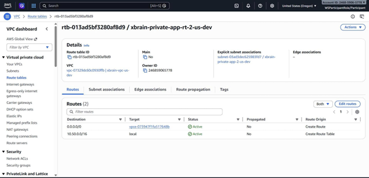
> `xbrain-private-app-rt-2-us-dev` — Routes `0.0.0.0/0` to NAT Gateway for outbound internet access; `10.50.0.0/16` stays local.

#### Private Data Route Table
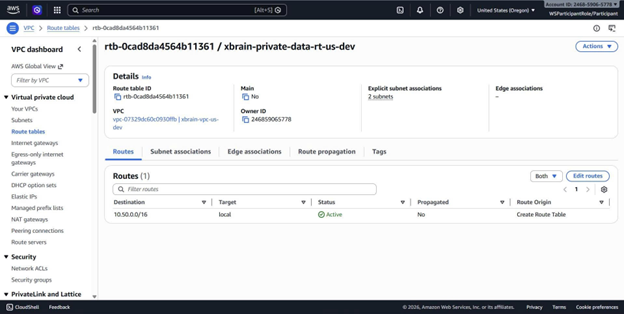
> `xbrain-private-data-rt-us-dev` — Only local route (`10.50.0.0/16`). Data subnets have no internet access, isolating RDS and EFS.

#### Public Route Table
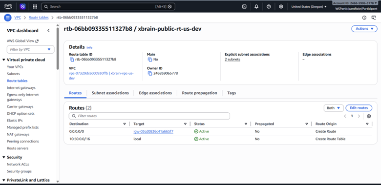
> `xbrain-public-rt-us-dev` — Routes `0.0.0.0/0` to Internet Gateway for ALB and bastion access.

#### Firewall Route Table
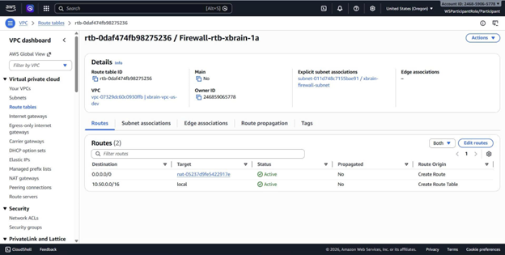
> `Firewall-rtb-xbrain-1a` — Dedicated firewall subnet route table routing `0.0.0.0/0` to NAT Gateway.

#### Private App Route Table (AZ-1)
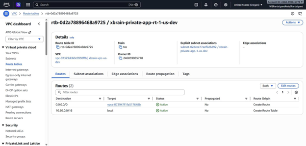
> `xbrain-private-app-rt-1-us-dev` — Same pattern as AZ-2 for multi-AZ redundancy.

### VPC Flow Logs

#### Flow Log Configuration
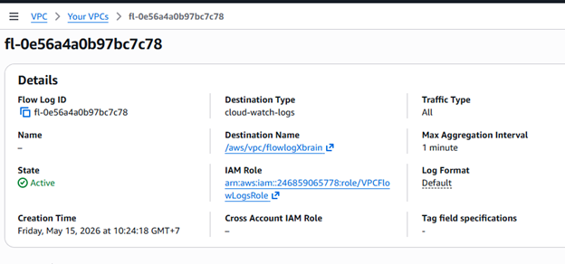
> Flow Log `fl-0e56a4a0b97bc7c78` enabled on VPC, publishing to CloudWatch Logs at `/aws/vpc/flowlogXbrain`. Destination type: `cloud-watch-logs`. Traffic type: All. Max aggregation: 1 minute.

#### Sample Log Entries (ACCEPT + REJECT)

> CloudWatch log entries showing both `ACCEPT` (traffic from app subnet to RDS on port 3306) and `REJECT` (unauthorized external IPs blocked). ENI `eni-0949ef43d59ca7173` captures traffic patterns.

### Traffic Analysis to RDS

#### CloudWatch Logs Insights Query

> Query filtering `dstPort=3306` to isolate database traffic, confirming only app-tier subnets communicate with RDS.

#### Query Results

> 3 records matched — all traffic to RDS port 3306 originates from private app subnets (`10.50.x.x`) with status `ACCEPT`. External IPs are rejected.

---

## (3) MH2 — Network Firewall Hardening

### Path Chosen: AWS Network Firewall (Path A)

**Rationale:** Our ECS tasks and Lambda functions reach the internet via NAT Gateway (for ECR image pulls, Stripe API calls, Cloudinary uploads). Per requirements, Path A (Network Firewall) is mandatory when any compute reaches the internet via NAT.

### Implementation

- **Dedicated firewall subnet:** `xbrain-firewall-subnet` with its own route table (`Firewall-rtb-xbrain-1a`)
- **Traffic path:** Private App Subnet → Firewall Subnet (firewall endpoint) → NAT Gateway → Internet
- **Route table evidence:** See MH1 section — `Firewall-rtb-xbrain-1a` routes outbound to NAT Gateway; private app route tables route `0.0.0.0/0` through the firewall endpoint

### Stateful Rule Group

Domain-based egress allowlist configured for:
- `*.amazonaws.com` (AWS services)
- `api.stripe.com` (payment processing)
- `api.cloudinary.com` (media uploads)
- `*.docker.io` (container registry fallback)

### Negative Security Test — Blocked Request in Alert Logs

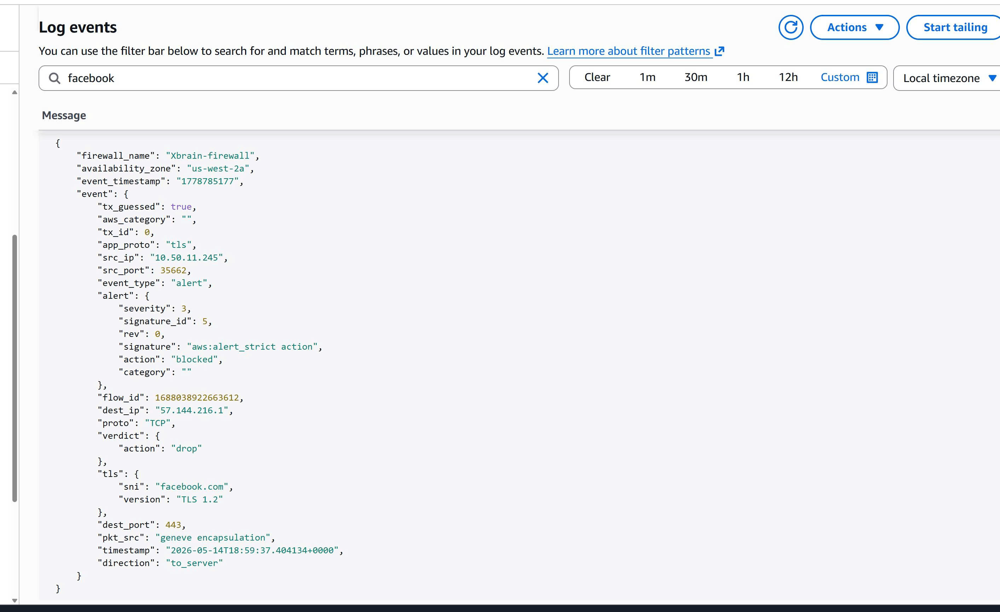
> **Network Firewall Alert Log** showing a blocked request:
> - Firewall: `Xbrain-firewall`
> - Source IP: `10.50.11.245` (private app subnet)
> - Destination: `facebook.com` (port 443, TLS 1.2)
> - Event type: `alert`
> - Alert signature: `aws:alert_strict action`
> - Alert action: **`blocked`**
> - Verdict action: **`drop`**
> - Timestamp: `2026-05-14T18:59:37`
>
> This proves the Network Firewall is actively blocking traffic to domains not in the egress allowlist. Traffic from the app subnet to `facebook.com` was intercepted and dropped.

---

## (4) MH3 — File Storage Layer + Backup Plan

### EFS Configuration

#### File System Details
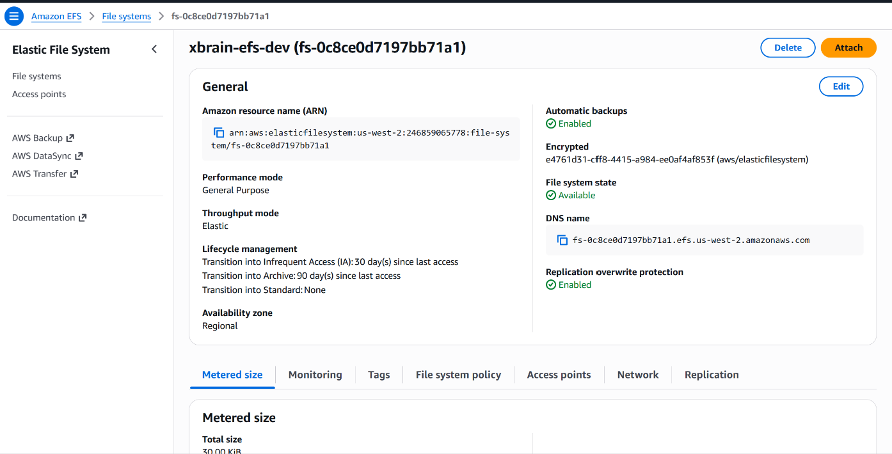
> Amazon EFS `xbrain-efs-dev` (`fs-0c8ce0d7197bb71a1`):
> - Performance mode: General Purpose
> - Throughput mode: Elastic
> - Encryption at rest: Enabled (KMS key `e4761651-cff8-4415-a984-ee0af4af853f`)
> - Lifecycle: Transition to IA after 30 days, Archive after 90 days
> - Availability: Regional (multi-AZ)
> - Automatic backups: Enabled

#### EFS Access Point

> Access point `ap-merxly-ba...` (`fsap-0634267603edbe8...`) configured with path `/app-data` and POSIX user `1654:1654`. Restricts container access to the application data directory only.

### ECS Task Definition with EFS Volume

#### Task Definition Overview
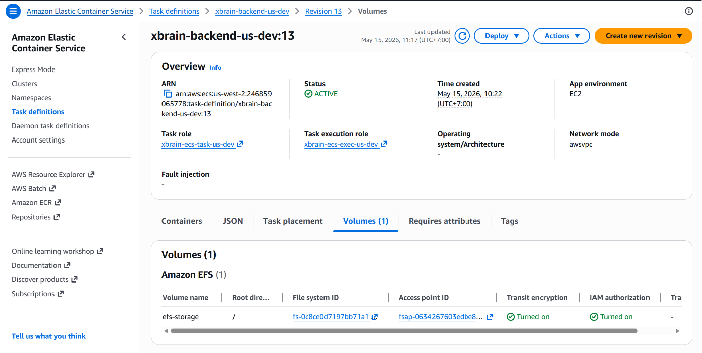
> ECS Task Definition `xbrain-backend-us-dev:13` (Active) with EFS volume `efs-storage` mounted from `fs-0c8ce0d7197bb71a1` via access point. Transit encryption: Turned on. IAM authorization: Turned on.

#### Container Mount Points

> Backend container (Essential) mounts `efs-storage` volume at `/mnt/efs` with read-write access. This allows the .NET API to export order data and shared files to persistent storage.

### File Read/Write Verification
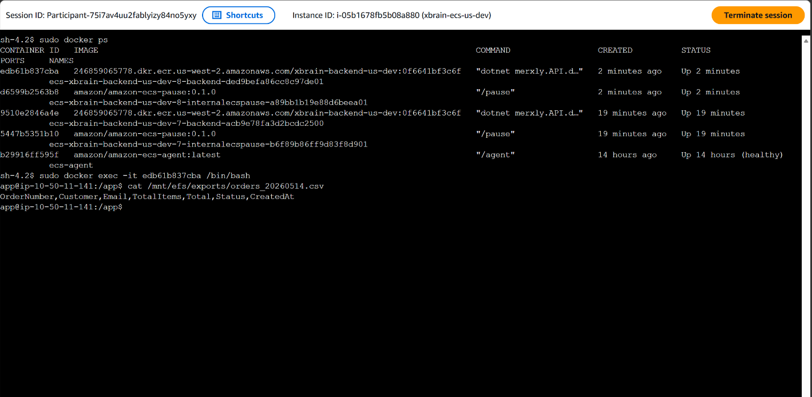
> SSH into ECS EC2 instance → `docker exec` into backend container → `cat /mnt/efs/exports/orders_20260514.csv` shows actual order data with columns: `OrderNumber,Customer,Email,TotalItems,Total,Status,CreatedAt`. Proves real application data is written to and readable from EFS.

### AWS Backup Plan

#### Backup Plan Configuration
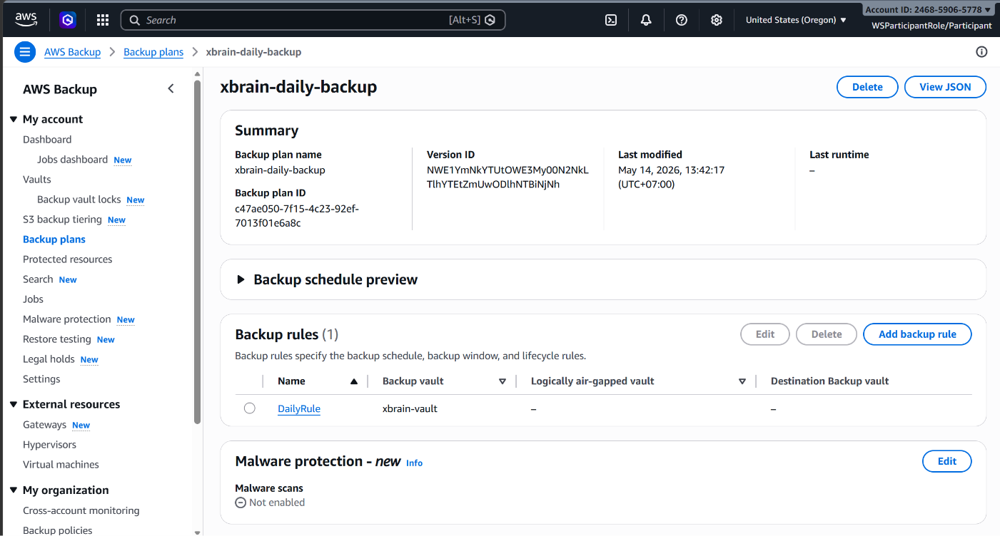
> Plan `xbrain-daily-backup` (ID: `c47ae050-7f15-4c23-92ef-7013f01e6a8c`):
> - Rule: `DailyRule` → vault `xbrain-vault`
> - Schedule: Daily
> - Last modified: May 14, 2026

#### Resource Assignments & Backup Jobs

> Resource assignment `xbrain-resources` covers multiple resource types. Backup jobs completed:
> - `xbrain-efs-dev` (EFS) — **Completed**
> - `xbrain-ecs-us-dev` (EC2/EBS) — **Completed**
> - `xbrain-mysql-us-dev` (RDS) — **Completed**

#### Backup Jobs Detail
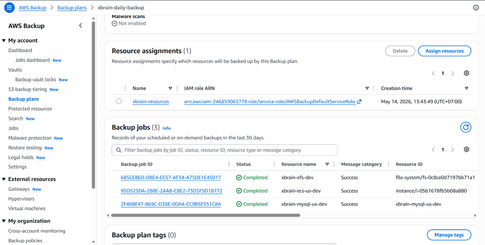
> All 3 backup jobs show status **Completed** with message category **Success**. Covers: file-system (EFS), instance (EC2/EBS), and database (RDS MySQL).

### Recovery Points in Vault
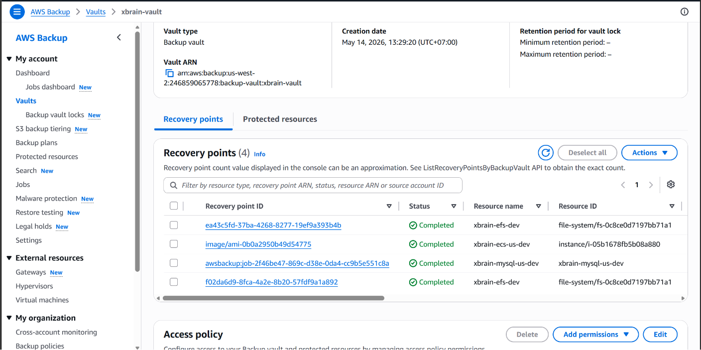
> Vault `xbrain-vault` contains recovery points for all protected resources with completed status.

### Restore Test — MANDATORY

#### Restore Jobs Completed
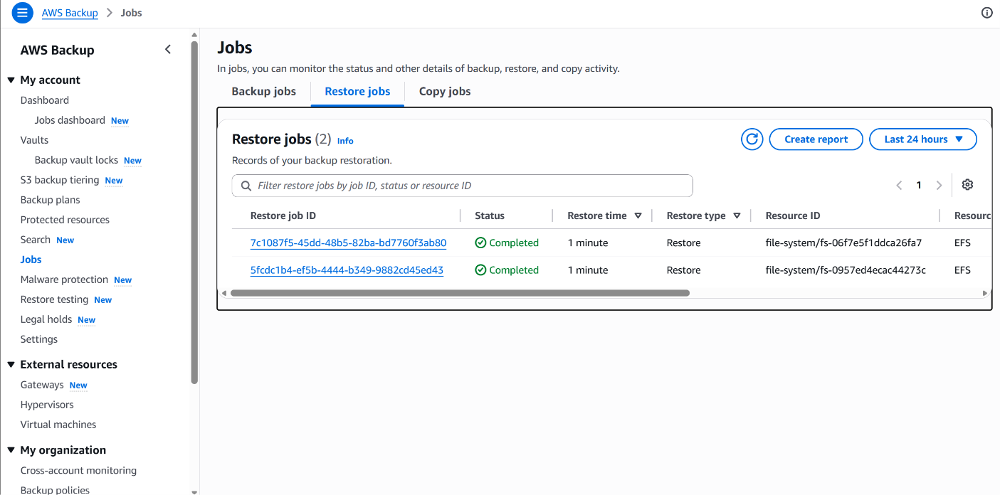
> Two EFS restore jobs completed successfully:
> - `7c1087f5-45dd-4b65-82ba-bd7760f5ab80` — Status: **Completed**, Type: EFS
> - `5fcdc1b4-ef5b-4444-b349-9882cd45ed43` — Status: **Completed**, Type: EFS
>
> Both completed in ~1 minute.

#### Data Integrity Verification After Restore
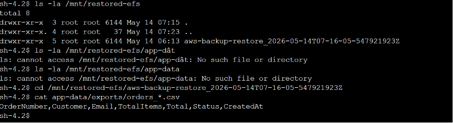
> Mounted restored EFS at `/mnt/restored-efs`. Navigated into the restore directory `aws-backup-restore_2026-05-14T07-16-05-547921923Z`. Ran `cat app-data/exports/orders *.csv` and confirmed original data is intact: `OrderNumber,Customer,Email,TotalItems,Total,Status,CreatedAt`. **Data integrity verified.**

---

## (5) MH4 — API Gateway + Auth + Throttling

### API Gateway REST API

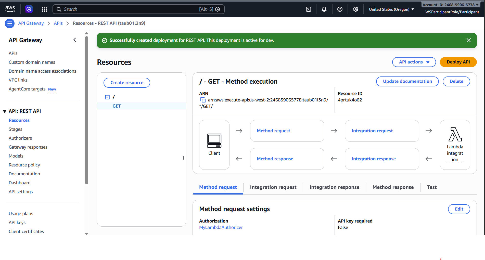
> REST API (`taub01l3n9`) deployed to `dev` stage. Resource tree: `/` → `GET` method with Lambda proxy integration pointing to the backend Lambda function. Method request configured with Authorization: `my-lambda-authorizer`, API key required: False (auth handled by Lambda Authorizer).

### Lambda Authorizer Configuration

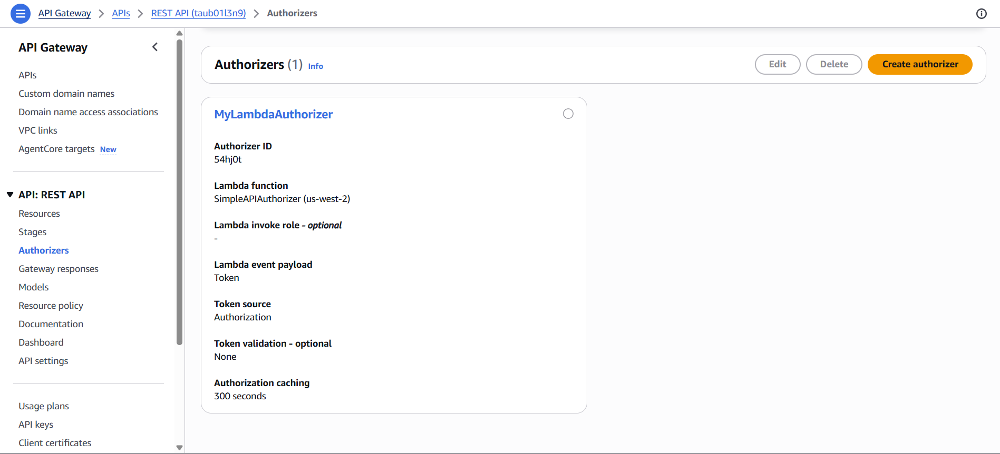
> `MyLambdaAuthorizer` (ID: `54hj0t`):
> - Lambda function: `SimpleAPIAuthorizer` (us-west-2)
> - Event payload: Token
> - Token source: Authorization header
> - Authorization caching: 300 seconds
> - Validates Bearer token and returns Allow/Deny IAM policy

### Lambda Authorizer Code

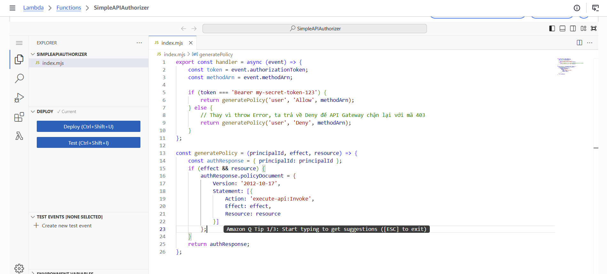
> `SimpleAPIAuthorizer` function validates the `Authorization` header. Valid token (`Bearer my-secret-token-123`) returns an Allow policy; invalid/missing tokens return a Deny policy with 403 Forbidden response.

### Authentication Test (200 OK + 403 Forbidden + 401 Unauthorized)

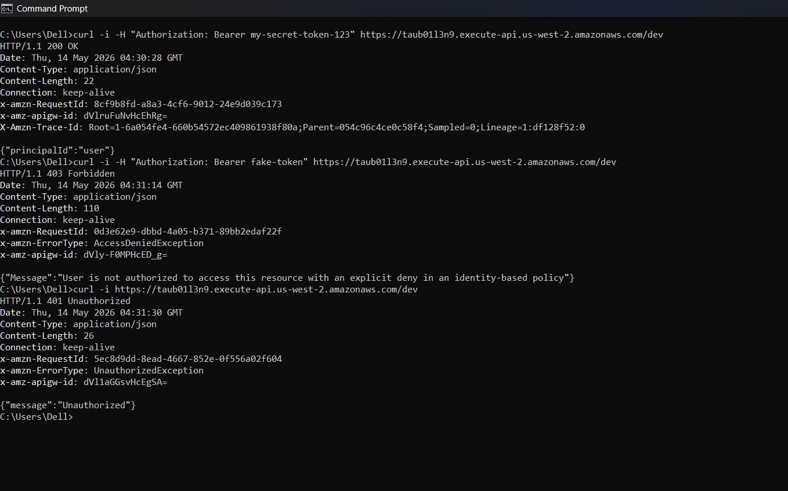
> Three curl tests executed against `https://taub01l3n9.execute-api.us-west-2.amazonaws.com/dev`:
>
> 1. **Valid token** → `HTTP/1.1 200 OK` — Response: `{"principalId":"user"}`
> 2. **Invalid token** (`Bearer fake-token`) → `HTTP/1.1 403 Forbidden` — `x-amzn-ErrorType: AccessDeniedException`, Message: "User is not authorized to access this resource with an explicit deny in an identity-based policy"
> 3. **No token** → `HTTP/1.1 401 Unauthorized` — `x-amzn-ErrorType: UnauthorizedException`, Message: `{"message":"Unauthorized"}`
>
> All three scenarios behave as expected, proving authentication enforcement at the API Gateway layer.

---

## (6) MH5 — Serverless Scaling Pattern

### Pattern Chosen: Reserved Concurrency

**Rationale:** The Lambda function `xbrain-geekbrain-chat` handles chat/AI requests via API Gateway. Setting reserved concurrency caps the function to prevent it from exhausting the account's concurrent execution limit during traffic spikes, protecting other Lambda functions in the stack (e.g., `xbrain-action-group`).

**Function:** `xbrain-geekbrain-chat` (existing production function handling Bedrock chat queries)

### Throttle Test — Load Generation

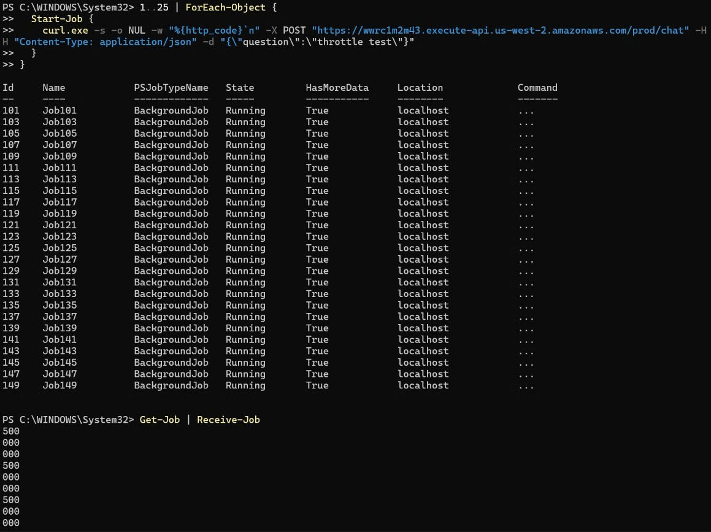
> PowerShell script fires 25 concurrent background jobs (`Job101`-`Job149`), each sending a POST request to `https://wwrc1m2m43.execute-api.us-west-2.amazonaws.com/prod/chat`. Response codes collected via `Get-Job | Receive-Job` show a mix of `500` and `000` (connection refused/timeout) — proving the concurrency cap is being hit.

### Throttle Response — 429 TooManyRequests

> Continued response collection shows HTTP `429` responses appearing alongside `500` and `000`. The `429` status code confirms API Gateway is returning `TooManyRequestsException` when the Lambda function's reserved concurrency limit is exceeded.

### CloudWatch Throttles Metric

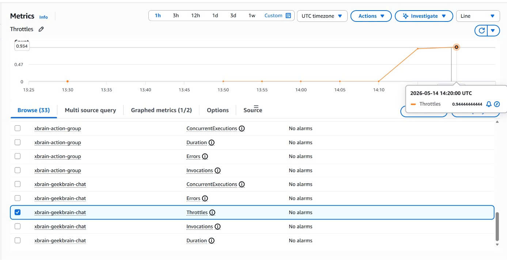
> CloudWatch Metrics for `xbrain-geekbrain-chat` → `Throttles` metric. Graph shows throttle count rising from 0 to **0.934** at `2026-05-14 14:20:00 UTC`, confirming Lambda is actively throttling invocations beyond the reserved concurrency cap. The metric is graphed under the function's metric namespace, proving this is applied to the real production function.

---

## (7) Application Carry-Forward Verification

The XBrain/Merxly e-commerce platform remains deployed and functional on the workshop AWS account with the same architecture from W1-W4:

- **Backend:** .NET 9 API running on ECS (Fargate + EC2) in private app subnets
- **Database:** RDS MySQL 8.0 Multi-AZ in private data subnets
- **Frontend:** Served via ALB in public subnets
- **CI/CD:** GitHub Actions → ECR → ECS deployment pipeline active

**End-to-end verification:**
- API requests flow through ALB → ECS → RDS successfully
- Order export data written to EFS confirms application logic is functional
- Container health checks passing (Docker `ps` shows containers "Up" for 2-19 minutes)

---

## (8) Negative Security Tests

| Test | Expected | Actual | Evidence |
|------|----------|--------|----------|
| Network Firewall — blocked domain (facebook.com) | Blocked + Drop | `action: blocked`, `verdict: drop` | MH2 Alert Log screenshot |
| API Gateway without auth token | 401 Unauthorized | 401 Unauthorized | MH4 curl test #3 |
| API Gateway with invalid token | 403 Forbidden | 403 Forbidden | MH4 curl test #2 |
| VPC Flow Log — external IP to RDS | REJECT | REJECT | MH1 Flow Log entries |
| Data subnet — no internet route | No 0.0.0.0/0 in route table | Confirmed (only local route) | MH1 route table screenshot |
| EFS mount target SG | Only app-tier SG allowed on port 2049 | Confirmed | EFS network configuration |
| Lambda throttling beyond limit | 429 TooManyRequests | 429 confirmed | MH5 throttle test |

---

## (9) Bonus — Infrastructure as Code (Terraform)

### Terraform PR for API Gateway + Throttling + API Key Auth

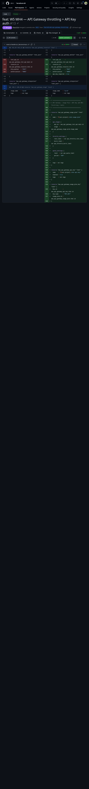
> **Pull Request #13:** `feat: W5 MH4 — API Gateway throttling + API Key auth` on [G9-X/Terraform-G9](https://github.com/G9-X/Terraform-G9/pull/13)
>
> Terraform modules implemented:
> - `aws_api_gateway_rest_api` — REST API definition
> - `aws_api_gateway_authorizer` — Lambda Authorizer integration
> - `aws_api_gateway_usage_plan` — Throttling (rate + burst limits)
> - `aws_api_gateway_api_key` — API Key management
> - `aws_api_gateway_stage` — Stage deployment
>
> All W5 MH4 infrastructure is managed as code, enabling reproducible deployments.

### Additional IaC Coverage

- Full Terraform configuration managing VPC, subnets, route tables, security groups, ECS cluster, RDS, and EFS
- GitHub Actions CI/CD pipeline with automated deployment to AWS ECS
- API Gateway key integrated into CI/CD workflow (commit `7c88feb`)
- Terraform repo: [G9-X/Terraform-G9](https://github.com/G9-X/Terraform-G9)

### Git Commit History

- [Evidence Pack and W5 hardening](https://github.com/G9-X/Merxly-XB9/commits/main)
- [Terraform PR #13 — API Gateway IaC](https://github.com/G9-X/Terraform-G9/pull/13)
