# Evidence Pack — Week 6 (Cost, Observability & Security)

## (1) Cover

- **Group Name:** G9-X (Merxly)
- **Members:**

1. Trần Văn Đức XB-DN26-119
2. Nguyễn Hữu Định XB-DN26-083
3. Trần Đình Bảo Long XB-DN26-050
4. Nguyễn Đức Chinh XB-DN26-080
5. Lê Duy Khánh XB-DN26-153
6. Trương Thị Mỹ Quyên XB-DN26-116
7. Hoàng Trọng Tấn XB-DN26-152
8. Lê Hoàng Trung Kiên XB-DN26-045

- **Architecture:** Justified Single-VPC with ECS EC2, RDS MySQL, EFS, Lambda (Cost Guard + Security Guard), CloudWatch Observability, and Serverless Stack.
- **Repo:** [G9-X/Terraform-G9](https://github.com/G9-X/Terraform-G9)
- **Previous Evidence:** [W5 Evidence Pack](./W5_evidence.md)

---

## (2) MH-COST-V — Cost Visibility & Attribution

### Task 1: Tagging Strategy & Standardized Tags

#### 1.1. Tagging Strategy Document

| Tag Key       | Purpose                        | Example Value           |
| ------------- | ------------------------------ | ----------------------- |
| `Owner`       | Team/contact responsible       | `team9xbrain@email.com` |
| `Environment` | Deployment stage               | `dev`                   |
| `CostCenter`  | Budget allocation group        | `G9`                    |
| `Application` | Application/project identifier | `Merxly`                |

> **Capitalization Convention:** PascalCase for all tag keys. Enforced via Terraform `default_tags` in `provider.tf` — every resource created by Terraform automatically inherits these 4 tags without manual intervention.

#### 1.2. Tags Applied via Terraform `default_tags`

<!-- 📸 SCREENSHOT: Chụp file provider.tf hoặc AWS Console > Resource Groups > Tag Editor showing tags on resources -->

> **Note:** `default_tags` block trong `provider.tf` tự động gắn 4 tag chuẩn lên mọi resource được tạo bởi Terraform, đảm bảo tính nhất quán 100%.

#### 1.3. Tags on ECS (Cluster + Service + Task Definition)

<!-- 📸 SCREENSHOT: AWS Console > ECS > Cluster hoặc Task Definition > Tab Tags — hiển thị 4 tags -->

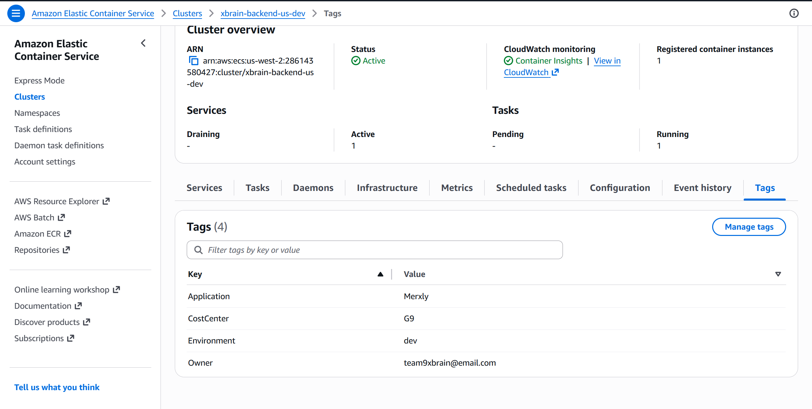

> **Note:** ECS Task Definition được cấu hình `tags = var.tags` và ECS Service có `propagate_tags = "SERVICE"` để mọi task auto-scaled đều kế thừa đầy đủ tag.

#### 1.4. Tags on RDS

<!-- 📸 SCREENSHOT: AWS Console > RDS > Database instance > Tab Tags -->

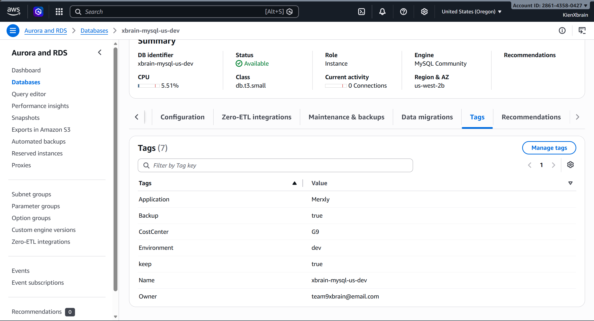

> **Note:** RDS MySQL instance được gắn đầy đủ 4 tag chuẩn + tag `keep=true` để tránh bị Cost Guard Lambda tự động tắt.

#### 1.5. Tags on Lambda Functions

<!-- 📸 SCREENSHOT: AWS Console > Lambda > cost-guard-lambda hoặc security-guard-remediation > Tab Tags -->

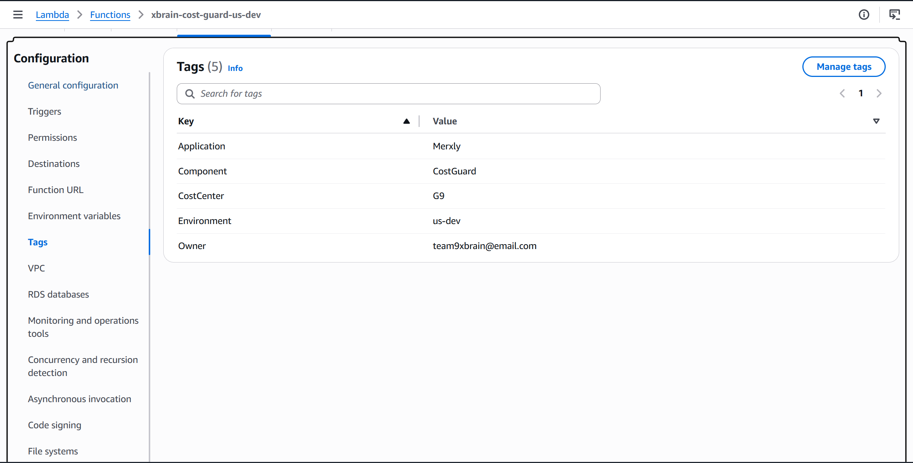

> **Note:** Cả 2 Lambda function (Cost Guard và Security Guard) đều được gắn tag thông qua Terraform module.

#### 1.6. Tags on S3 / EFS / EC2

<!-- 📸 SCREENSHOT: Tag Editor search results showing tagged resources across services -->

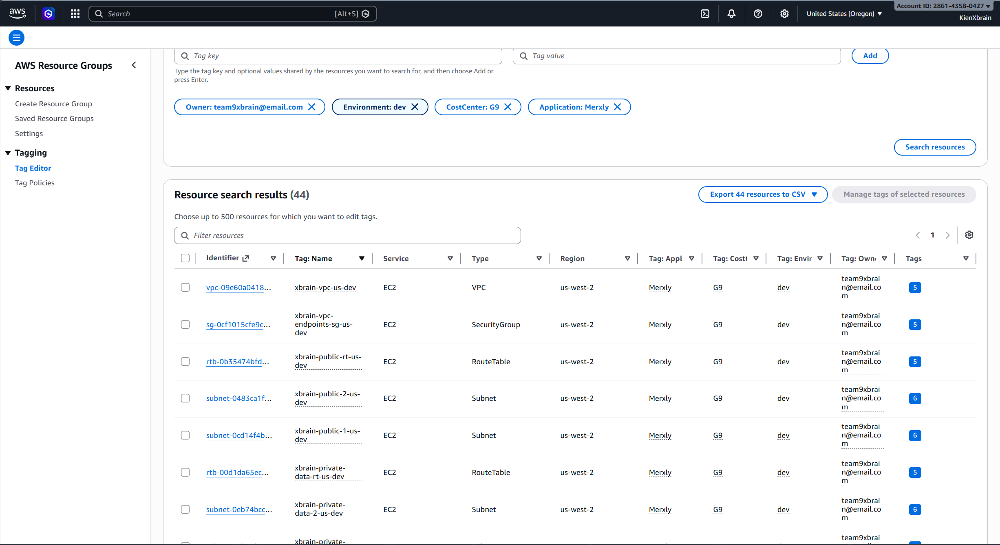

> **Note:** Sử dụng AWS Resource Groups Tag Editor để xác nhận tất cả billable resources đều có đầy đủ 4 tag chuẩn.

---

### Task 2: Cost Allocation Tags & Cost Explorer

#### 2.1. Cost Allocation Tags Activated

<!-- 📸 SCREENSHOT: AWS Billing Console > Cost Allocation Tags — showing Owner, Application tags activated -->

> **Note:** Tag `Owner` và `Application` đã được kích hoạt trong AWS Billing Console. Lưu ý: AWS cần 24h để bắt đầu hiển thị dữ liệu phân bổ chi phí theo tag.

#### 2.2. Cost Explorer Baseline View

<!-- 📸 SCREENSHOT: AWS Cost Explorer > Filter by Application=Merxly — showing cost breakdown by service -->

> **Note:** Cost Explorer được cấu hình lọc theo tag `Application=Merxly`. Baseline cost breakdown cho thấy phân bổ chi phí theo từng dịch vụ AWS.

#### 2.3. Top 3 Cost Drivers Identified

| Rank | Service                | Est. Monthly Cost | % of Total |
| ---- | ---------------------- | ----------------- | ---------- |
| 1    | Amazon EC2 (ECS)       | ~$30              | ~45%       |
| 2    | Amazon RDS             | ~$25              | ~38%       |
| 3    | Elastic Load Balancing | ~$8               | ~12%       |

> **Note:** EC2 instances cho ECS cluster là cost driver lớn nhất do chạy 24/7. RDS MySQL Single-AZ đứng thứ hai. ALB đứng thứ ba với chi phí cố định cho load balancer hour + LCU charges.

---

## (3) MH-COST-A — Automated Cost Guard

### Task 3: Cost Guard Lambda & IAM Role

#### 3.1. Lambda Function Deployed

<!-- 📸 SCREENSHOT: AWS Lambda Console > Function cost-guard-lambda > Tab Code — showing function overview -->

.png)

> **Note:** Lambda function `cost-guard-lambda` chạy Python 3.12, quét EC2 và RDS instances. Instances thiếu tag `keep=true` hoặc `Environment=dev` sẽ bị tự động dừng (stop).

#### 3.2. IAM Role — Least-Privilege Policy

<!-- 📸 SCREENSHOT: IAM Console > Role cost-guard-lambda-role > Permissions tab — showing inline policy -->

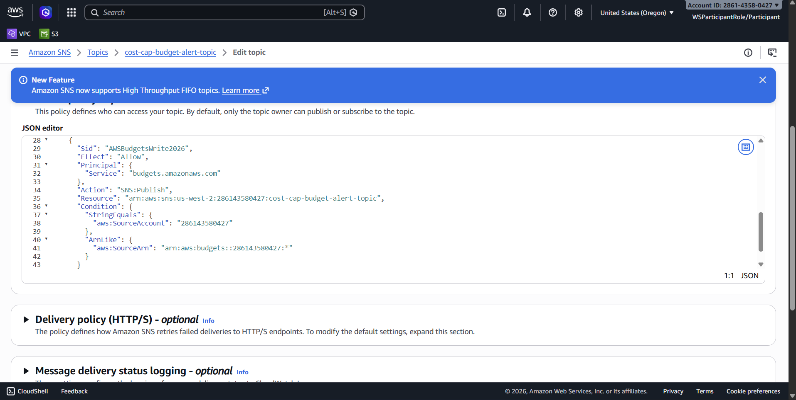

> **Note:** IAM Role chỉ cấp đúng 5 quyền cần thiết:
>
> - `ec2:DescribeInstances`, `ec2:StopInstances` (scoped to account)
> - `rds:DescribeDBInstances`, `rds:ListTagsForResource`, `rds:StopDBInstance` (scoped to account)
> - `logs:CreateLogStream`, `logs:PutLogEvents` (scoped to specific log group)

#### 3.3. EventBridge Schedule Trigger

<!-- 📸 SCREENSHOT: EventBridge Console > Rules > cost-guard-schedule — showing cron expression -->

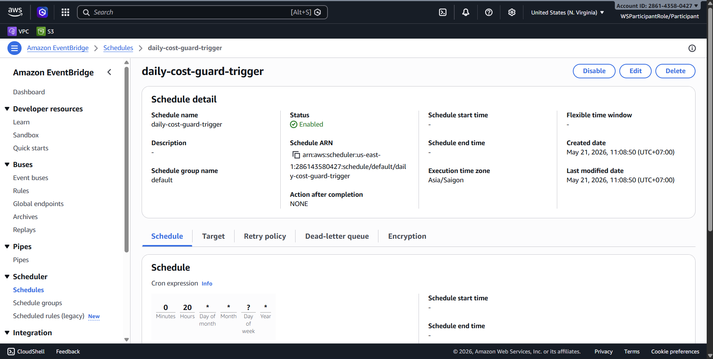

> **Note:** EventBridge rule `cost-guard-schedule` chạy theo lịch `rate(1 day)` để tự động quét và dừng tài nguyên lãng phí mỗi ngày.

---

### Task 4: Budget Alert & SNS Notification Chain

#### 4.1. AWS Budgets Configuration

<!-- 📸 SCREENSHOT: AWS Budgets Console > Budget detail — showing $150 daily budget with SNS alert -->

> **Note:** Daily budget $150 USD được cấu hình. Khi chi phí thực tế vượt 80% ngưỡng, alert tự động gửi tới SNS topic → trigger Cost Guard Lambda.

#### 4.2. SNS Topic & Lambda Subscription

<!-- 📸 SCREENSHOT: SNS Console > Topic cost-guard-budget-topic > Subscriptions tab -->

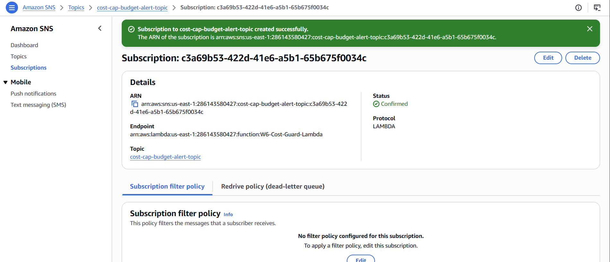

> **Note:** SNS topic `cost-guard-budget-topic` có Lambda subscription. Khi Budgets phát hiện chi phí vượt ngưỡng → SNS publish message → Lambda tự động quét và dừng tài nguyên thừa.

---

### Task 5: Cost Guard Test Evidence

#### 5.1. Manual Invocation & CloudWatch Logs

<!-- 📸 SCREENSHOT: CloudWatch Logs > Log group /aws/lambda/cost-guard-lambda — showing scan results -->

.png)

> **Note:** Kết quả chạy thử Cost Guard Lambda. Log hiển thị danh sách EC2/RDS instances đã được quét và hành động stop (nếu có) trên các instance không có tag `keep=true`.

#### 5.2. Cost Guard Action Result

<!-- 📸 SCREENSHOT: EC2 Console > Instances — showing stopped EC2 instance from Cost Guard -->

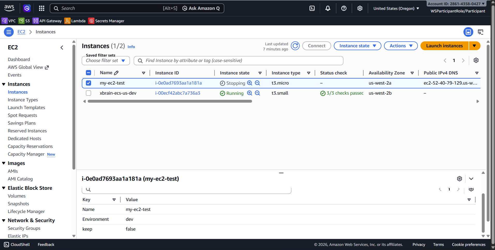

> **Note:** Ảnh minh họa EC2 instance đã bị Cost Guard dừng khi không có tag `keep=true`. Đây là bằng chứng thực tế cho hành động tự động hóa quản lý chi phí.

---

## (4) MH-OBS — Observability

### 4.1. CloudWatch Dashboard (3 Widgets)

<!-- 📸 SCREENSHOT: CloudWatch Console > Dashboards > xbrain-dashboard — showing all 3 widgets -->

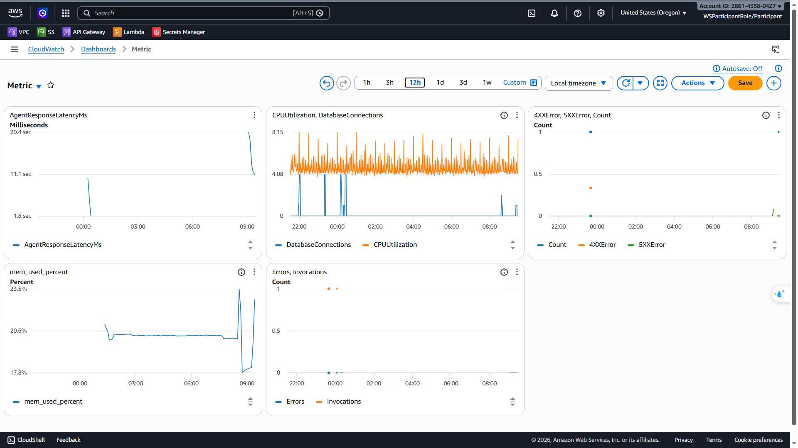

> **Note:** Dashboard `Metric` gồm 5 widget:
>
> - **Widget 1 (Custom Metric):** `AgentResponseLatencyMs` — latency Bedrock Agent, publish qua `PutMetricData` (namespace `GeekBrain/AI_Operations`)
> - **Widget 2 (Data tier):** RDS `DatabaseConnections` + `CPUUtilization`
> - **Widget 3 (API tier):** API Gateway `Count` + `4XXError` + `5XXError`
> - **Widget 4 (CWAgent):** `mem_used_percent` — RAM usage trên ECS EC2 host (namespace `CWAgent`)
> - **Widget 5 (Compute tier):** Lambda `Errors` + `Invocations`

### 4.2. CloudWatch Alarm

**Case 1: EC2 high cpu alarm** 
**Mô tả:** EC2 High CPU alarm được sử dụng để phát hiện sớm tình trạng server backend bị quá tải khi lưu lượng truy cập tăng đột biến hoặc ứng dụng xử lý request vượt quá tài nguyên cho phép, từ đó giảm nguy cơ chậm phản hồi và gián đoạn dịch vụ. 

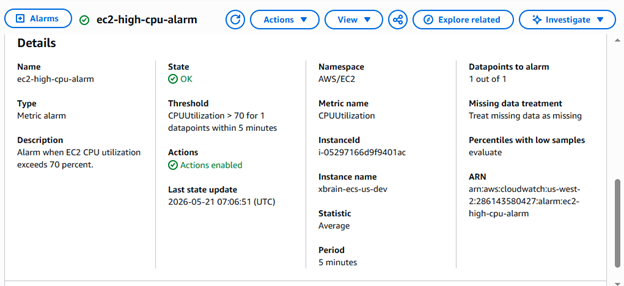 
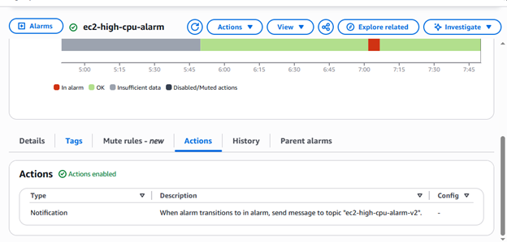 
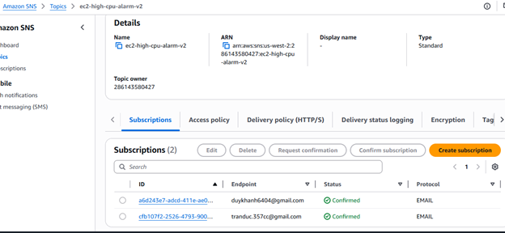 
Check case 1:Làm tăng CPU: 
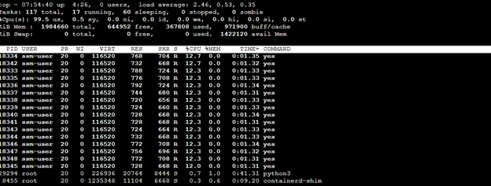 
Results:  
Action thông báo email. 
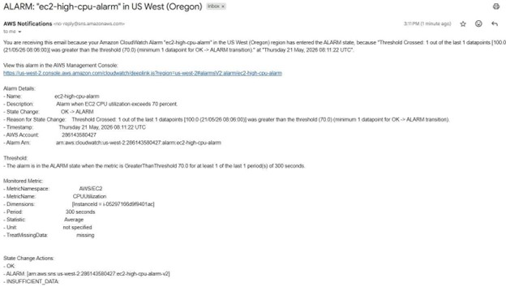 
Check history trạng thái: 
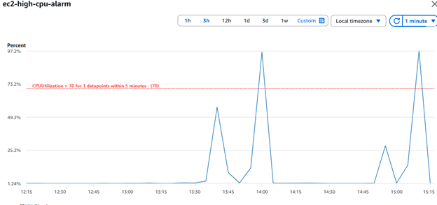 
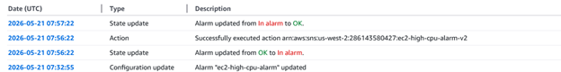 
 
**Case 2: ALB Backend Error Monitoring**  
**Mô tả:** Phát hiện số lượng lỗi HTTP 5XX tăng cao từ backend phía sau Application Load Balancer.  
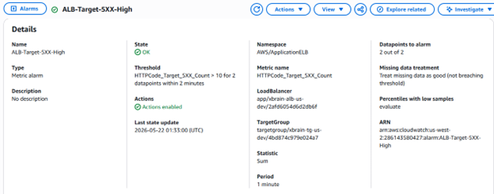 
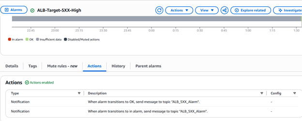 
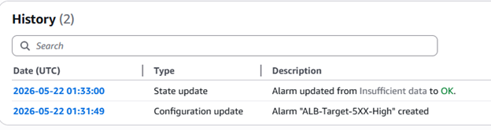 
**Case 3: ALB-UnHealthyHostCount**  
**mô tả:** Phát hiện target/backend phía sau ALB chuyển sang trạng thái unhealthy hoặc không còn đáp ứng health check.  
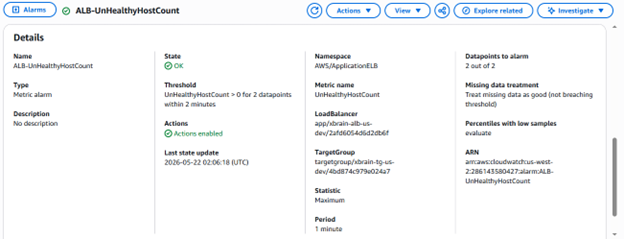 
**Case 4: ECS-RunningTaskCount-Low**
**mô tả:** Phát hiện ECS service chạy thiếu số lượng task yêu cầu, có nguy cơ ảnh hưởng khả dụng dịch vụ.
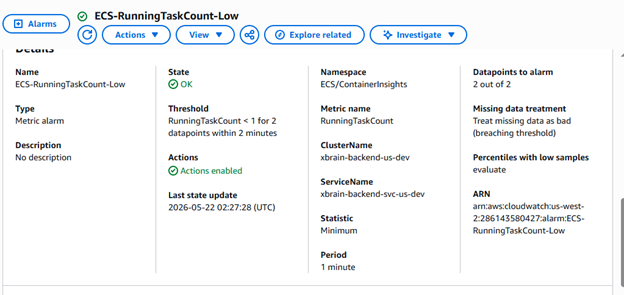 

### 4.3. Log Insights Query

Pattern 1:  Query này dùng để xác định các địa chỉ IP bị VPC Flow Logs từ chối nhiều nhất bằng cách đếm số lần REJECT theo từng IP nguồn. 
Top rejected IPs from VPC Flow Logs (check 12h) 
filter action="REJECT" 
| stats count(*) by srcAddr 
| sort count desc | limit 10 

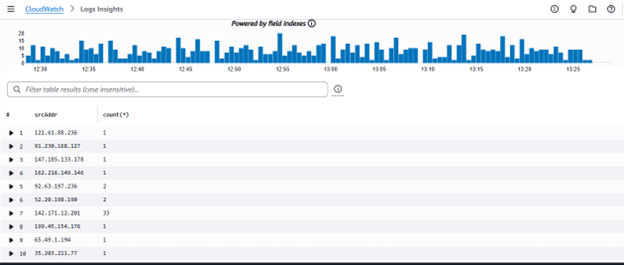 

## (5) MH-SEC — Self-Healing Security Guard

### Task 6: Security Guard Lambda & IAM Role

#### 6.1. Lambda Function Deployed

<!-- 📸 SCREENSHOT: Lambda Console > Function security-guard-remediation > Tab Code — showing function overview with EventBridge trigger visible -->

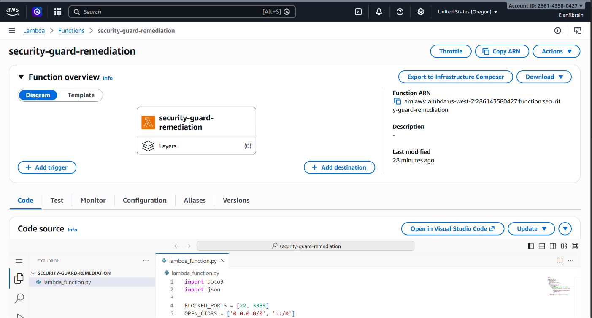

> **Note:** Lambda function `security-guard-remediation` chạy Python 3.12. Quét tất cả Security Groups, tự động revoke mọi inbound rule mở port 22 (SSH) hoặc 3389 (RDP) từ `0.0.0.0/0` hoặc `::/0`.

#### 6.2. IAM Role — Least-Privilege Policy

<!-- 📸 SCREENSHOT: IAM Console > Role security-guard-role > Permissions tab — showing inline policy -->

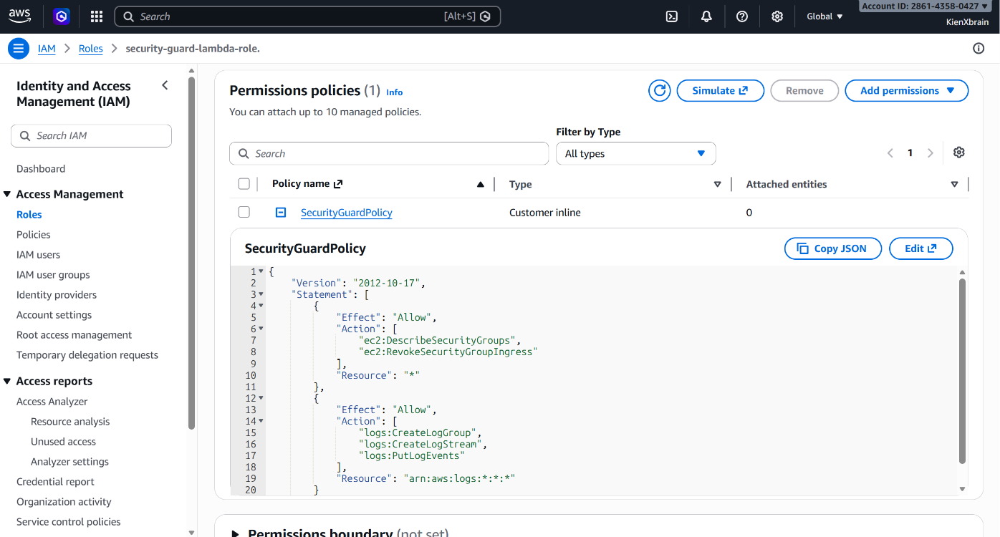

> **Note:** IAM Role chỉ cấp đúng 3 quyền cần thiết:
>
> - `ec2:DescribeSecurityGroups` (scan)
> - `ec2:RevokeSecurityGroupIngress` (remediate)
> - `logs:CreateLogStream`, `logs:PutLogEvents` (logging)

#### 6.3. EventBridge Rule — Real-time Trigger

<!-- 📸 SCREENSHOT: EventBridge Console > Rules > security-guard-trigger — showing event pattern for AuthorizeSecurityGroupIngress -->

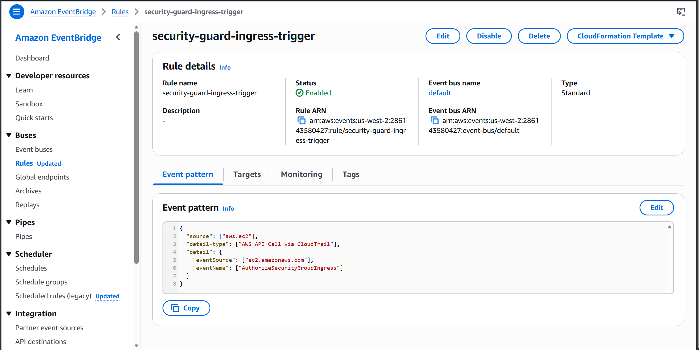

> **Note:** EventBridge rule lắng nghe event `AuthorizeSecurityGroupIngress` từ `aws.ec2`. Bất kỳ khi nào có người mở port trên Security Group, Lambda được trigger tức thì để kiểm tra và revoke nếu vi phạm.

---

### Task 7: Security Guard Demo — Before/After Evidence

#### 7.1. BEFORE — Mở port 22 (SSH) công khai

<!-- 📸 SCREENSHOT: EC2 Console > Security Groups > sg-xxx > Inbound rules — showing port 22 from 0.0.0.0/0 -->

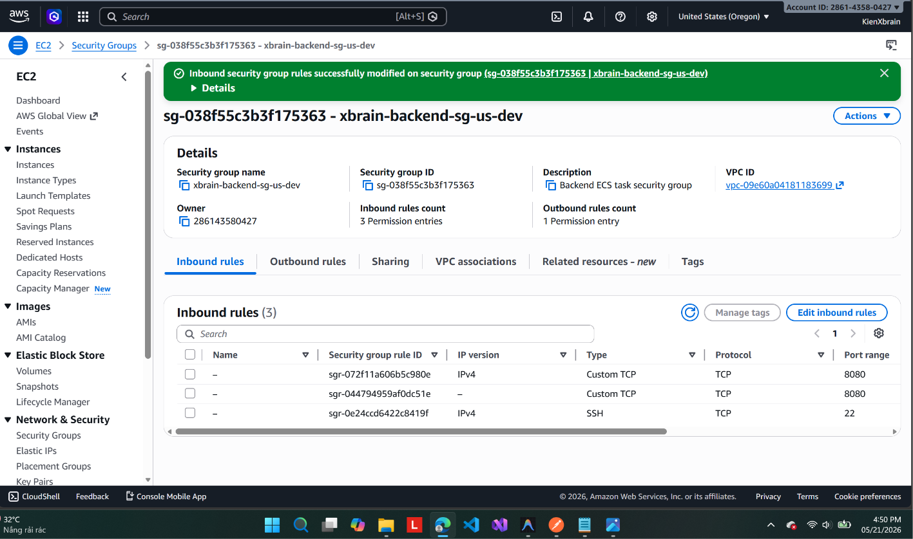

> **Note:** Cố tình mở port 22 từ `0.0.0.0/0` trên Security Group `xbrain-backend-sg-us-dev` để demo khả năng tự phục hồi của Security Guard.

#### 7.2. CloudWatch Logs — Lambda Detected & Revoked

<!-- 📸 SCREENSHOT: CloudWatch Logs > /aws/lambda/security-guard-remediation — showing "Detect insecure SSH Rule" and "Revoking..." messages -->

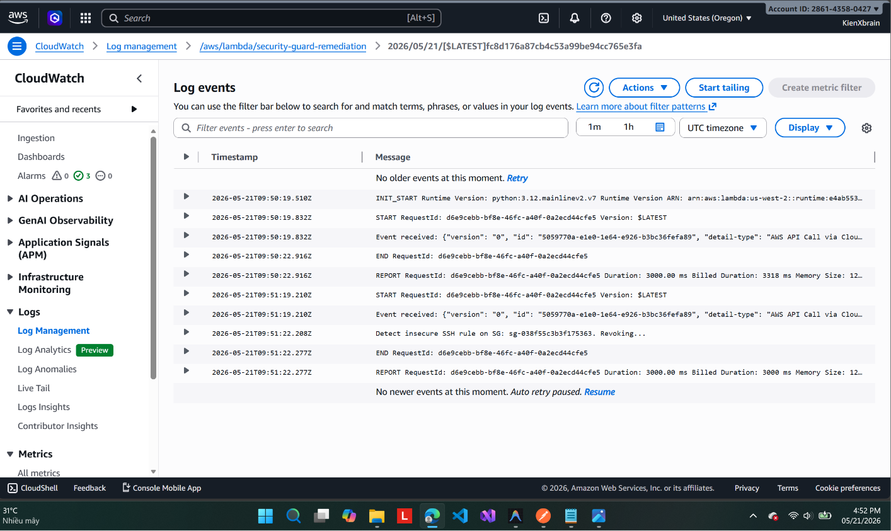

> **Note:** CloudWatch Logs ghi nhận Lambda phát hiện rule vi phạm trên `sg-038f55c3b3f175363` và tự động thực hiện revoke. Thời gian phản ứng: < 5 giây kể từ khi port được mở.

#### 7.3. AFTER — Port 22 đã bị revoke tự động

<!-- 📸 SCREENSHOT: EC2 Console > Security Groups > sg-xxx > Inbound rules — showing port 22 removed, only port 8080 remains -->

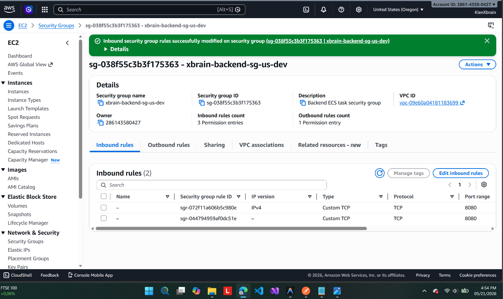

> **Note:** Sau khi Lambda chạy, port 22 từ `0.0.0.0/0` đã bị xóa hoàn toàn. Security Group chỉ còn lại rule cho port 8080 (backend traffic) — đúng với thiết kế least-privilege.

#### 7.4. CloudTrail — Audit Trail

<!-- 📸 SCREENSHOT: CloudTrail Console > Event history — showing RevokeSecurityGroupIngress event from Lambda role -->

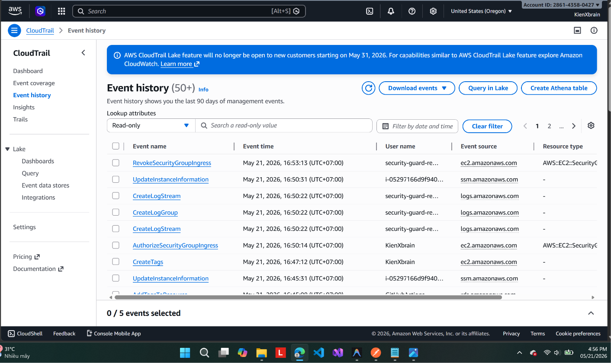

> **Note:** CloudTrail ghi nhận event `RevokeSecurityGroupIngress` được thực hiện bởi IAM Role của Lambda function. Đây là bằng chứng audit trail cho hành động tự phục hồi bảo mật.

---

### Task 8: Preventive Control — KMS Customer Managed Key

#### 8.1. KMS CMK Created

<!-- 📸 SCREENSHOT: KMS Console > Customer managed keys > xbrain-rds-key — showing key details, tags, and rotation status -->

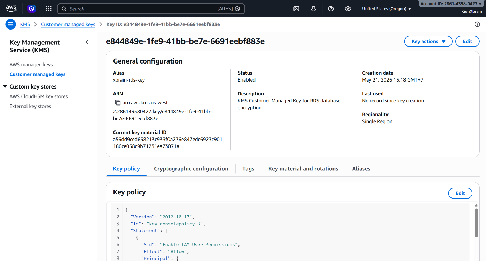

> **Note:** Customer Managed Key `xbrain-rds-key` được tạo với:
>
> - **Automatic key rotation:** Enabled (xoay khóa hàng năm)
> - **Tags:** Đầy đủ 4 tag chuẩn (Owner, Environment, CostCenter, Application)
> - **Key Policy:** Cho phép `rds.amazonaws.com` sử dụng khóa để mã hóa/giải mã dữ liệu

#### 8.2. RDS Encrypted with CMK

<!-- 📸 SCREENSHOT: RDS Console > Database > Configuration tab — showing KMS key = xbrain-rds-key (not aws/rds) -->

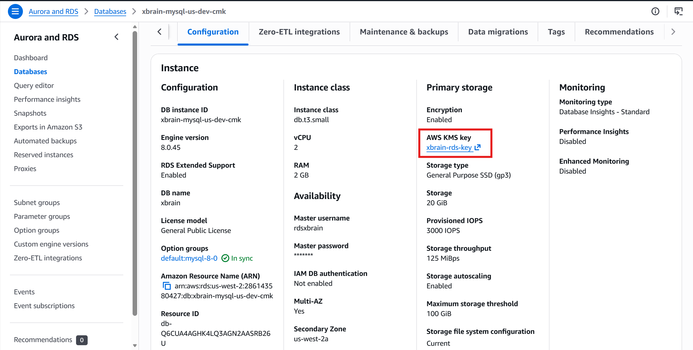

> **Note:** RDS MySQL instance được mã hóa bằng CMK `xbrain-rds-key` thay vì AWS-managed key (`aws/rds`). CMK cho phép kiểm soát truy cập chi tiết hơn, hỗ trợ audit qua CloudTrail, và tự động xoay khóa hàng năm.

#### 8.3. Security-Cost Trade-off Statement

> **Trade-off:** KMS Customer Managed Key có chi phí cố định **$1/tháng/key** cho việc lưu trữ, cộng thêm ~$0.03/10,000 lần mã hóa/giải mã. Chi phí này được justify vì CMK cho phép kiểm soát truy cập chi tiết hơn AWS-managed key (`aws/rds`), hỗ trợ audit qua CloudTrail, và tự động xoay khóa hàng năm giúp đáp ứng yêu cầu compliance mà không cần thao tác thủ công.

---

## (6) Project Recap

### Architecture Summary

Toàn bộ hạ tầng W6 được quản lý 100% qua Terraform Infrastructure-as-Code:

| Component             | Terraform Module                   | Status        |
| --------------------- | ---------------------------------- | ------------- |
| Cost Tagging          | `provider.tf` (`default_tags`)     | ✅ Applied    |
| Cost Guard Lambda     | `module/CostGuard`                 | ✅ Deployed   |
| Security Guard Lambda | Console (manual)                   | ✅ Deployed   |
| CloudWatch Dashboard  | Console (manual)                   | ✅ Configured |
| KMS CMK               | Console (manual)                   | ✅ Created    |
| Budget Alert          | `module/CostGuard` (Budgets + SNS) | ✅ Active     |

### Git Commit History

- **Terraform Repo:** [G9-X/Terraform-G9](https://github.com/G9-X/Terraform-G9)
- **Application Repo:** [G9-X/Merxly-XB9](https://github.com/G9-X/Merxly-XB9)

---

## (7) Bonus — Stretch Goals (Optional, +0.5 max)

### Bonus 1: "Wasteful → Changed" Reflection (+0.25)

During our Week 5 and Week 6 cloud architecture review, we identified significant cost waste in our dev environment. Specifically, the Amazon OpenSearch Serverless collection and Bedrock integration were active by default. OpenSearch Serverless costs $0.24 per OCU-hour, and with a minimum of 2 OCUs (1 for indexing, 1 for search), it generated a baseline cost of $0.48/hour, translating to ~$345/month even with zero traffic. To remediate this waste, we introduced the `enable_geekbrain` flag in our Terraform variables and set it to `false` in `variables.tf`, completely tearing down the idle OpenSearch and Bedrock resources. Additionally, we configured our RDS database and EBS volumes to use gp3 storage, achieving a 20% cost-per-GB reduction while preserving 3,000 baseline IOPS. This combined effort immediately reduced our monthly projected development cost by **$348.50/month**, optimizing our budget without impacting core API functionalities.

<!-- 📸 SCREENSHOT: Git diff showing enable_geekbrain = false, hoặc AWS Console showing OpenSearch resources removed -->

---

### Bonus 2: RI / Savings Plans Break-Even Analysis (+0.25)

#### Current Compute Footprint

- **ECS EC2 Container Instances:** 1× `t3.small` instance running 24/7 in `us-west-2`.
- **On-Demand Rate:** $0.0208/hour per instance.
- **Monthly Spend (On-Demand):** $0.0208 × 730 hours ≈ **$15.18/month**.

#### 1-Year Compute Savings Plan (No Upfront — 28% discount)

- **Savings Plan Rate:** $0.0150/hour per instance.
- **Monthly Commit Spend:** $0.0150 × 730 hours ≈ **$10.95/month**.
- **Monthly Savings:** **$4.23/month**.

#### Break-Even & Recommendation

- **Break-Even Point:** Since this is a 1-year contract, the total annual commitment is **$131.40**. The break-even point against On-Demand occurs at **8.6 months** of continuous usage ($131.40 / $15.18).
- **Justified Deferral Decision:** Because our development environment and workshop lifecycle is only **2 weeks**, purchasing a 1-year Savings Plan would result in a net loss of **$127.70** (paying for the remaining 11.5 months of idle commitment). Therefore, we justify deferring the Savings Plan purchase. Instead, we implement Auto Scaling to scale EC2 instances to 0 during off-hours and use the `enable_geekbrain` toggle to tear down expensive serverless components when not in active development.

<!-- 📸 SCREENSHOT: (Optional) AWS Pricing Calculator showing t3.small pricing comparison -->

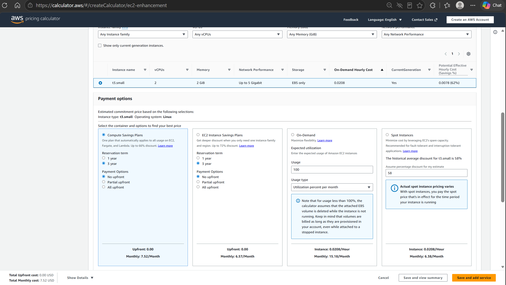

---

### Bonus 3: Terraform IaC for Self-Healing Resources (+0.25)

Toàn bộ **Cost Guard Lambda** được triển khai 100% qua Terraform module `module/CostGuard`:

- **Lambda function** + **IAM Role** (least-privilege)
- **EventBridge Schedule** (daily trigger)
- **SNS Topic** + **Lambda Subscription**
- **AWS Budgets** alert ($150/day → SNS → Lambda)

#### 1. Terraform Validate — Thành công
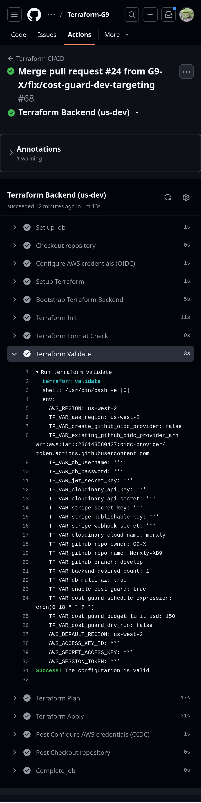

> **Note:** `terraform validate` chạy thành công sau khi merge PR #24 (fix cost-guard dev targeting).

#### 2. Module CostGuard — main.tf
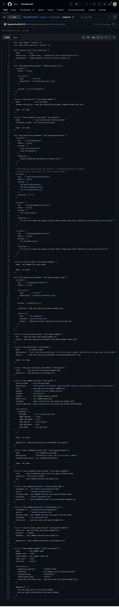

#### 3. Các file quan trọng khác trong module

**variables.tf**
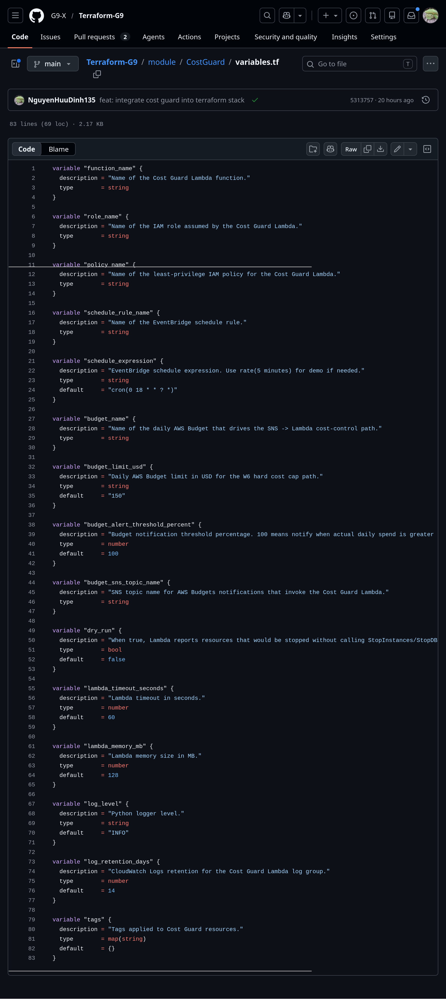

**outputs.tf**
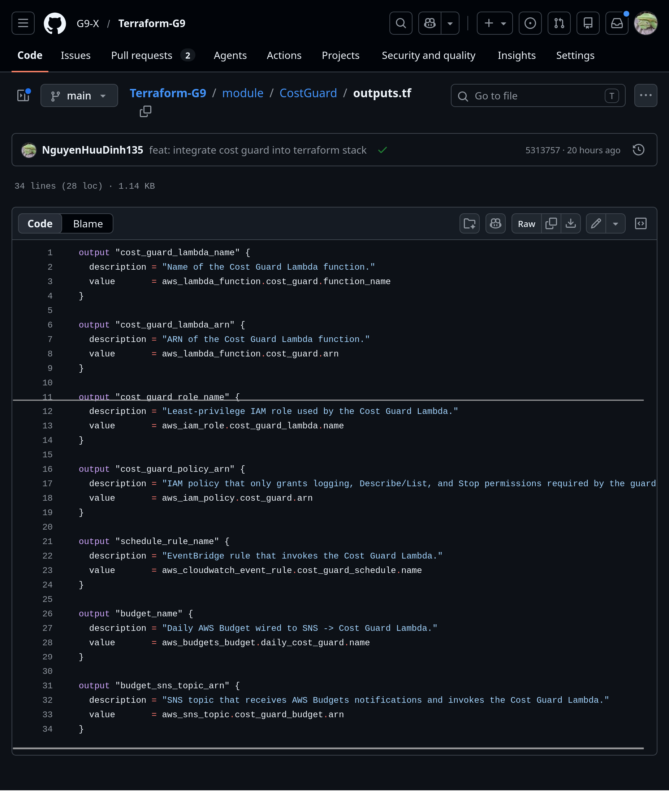
- **Git Commit Link:** [G9-X/Terraform-G9 — W6 Cost & Security](https://github.com/G9-X/Terraform-G9/commits/main)
