# Evidence Pack — Week 6 (Cost, Observability & Security)

## (1) Cover

- **Group Name:** G9-X (Merxly)
- **Members:**

1. Trần Văn Đức XB-DN26-119
2. Nguyễn Hữu Định XB-DN26-083
3. Trần Đình Bảo Long XB-DN26-050
4. Nguyễn Đức Chinh XB-DN26-080
5. Lê Duy Khánh XB-DN26-153
6. Trương Thị Mỹ Quyên XB-DN26-116
7. Hoàng Trọng Tấn XB-DN26-152
8. Lê Hoàng Trung Kiên XB-DN26-045

- **Architecture:** Justified Single-VPC with ECS EC2, RDS MySQL, EFS, Lambda (Cost Guard + Security Guard), CloudWatch Observability, and Serverless Stack.
- **Repo:** [G9-X/Terraform-G9](https://github.com/G9-X/Terraform-G9)
- **Previous Evidence:** [W5 Evidence Pack](./W5_evidence.md)

Ở tuần thứ 3 evidence pack thì khi chụp bọn em đã chụp mỗi log khi con bedrock trả lời, nên chưa show rõ là có sài RAG hay invoke model thuần. Ở tuần 3 khi đó, tụi em chưa sài bedrock agent, mà chỉ tạo knowledge base rồi chuẩn bị sẵn dữ liệu ở s3, rồi code lambda sẽ sử dụng hàm retrieve kb_id, sau khi có dữ liệu, mới sài hàm converse invoke model để nó trả lời. Còn ở tuần 4 và 5 bọn em đã cải tiến thêm, tạo Bedrock Agent, để agent quyết định xem câu hỏi đó liệu nó sẽ sử dụng kb để có dữ liệu trả lời hay sẽ gọi tool từ action group để lấy dữ liệu rồi mới gen câu trả lời

Ảnh code lambda tuần thứ 3
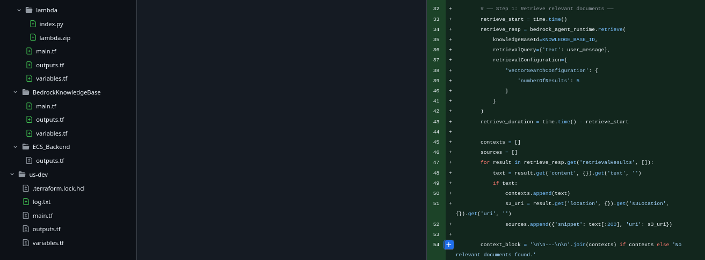
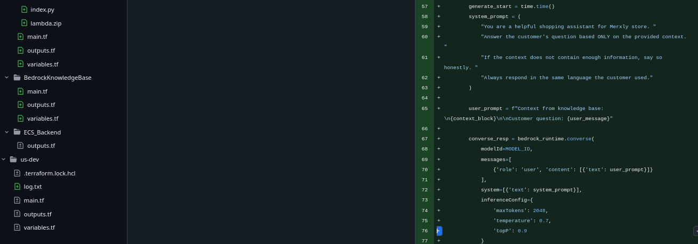

Ảnh lambda ở hiện tại

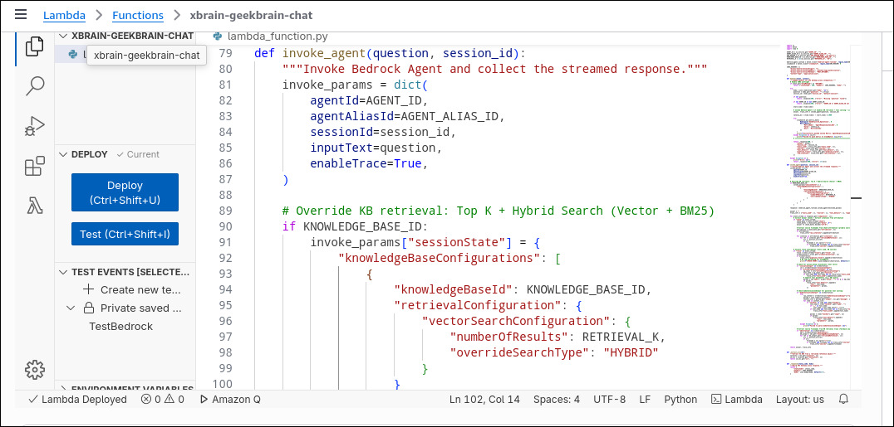
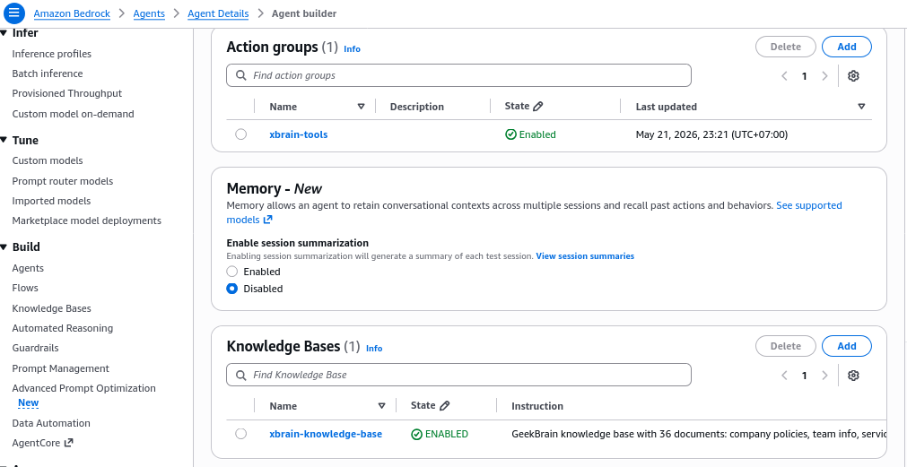

Phần Secret Managers của DB ở W3 chưa show nên tụi e cap lại ở pack tuần này
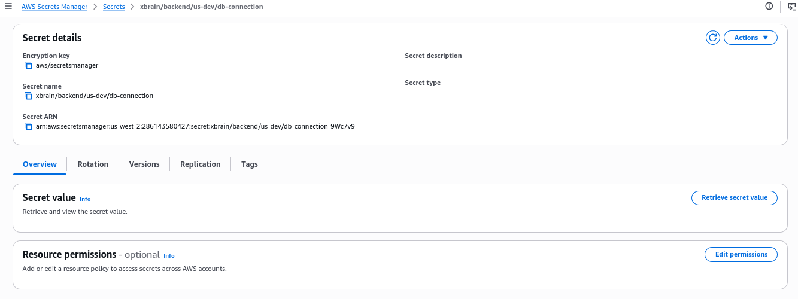
Secret của DB sẽ được set ở enviroment variable, task definitions ở ecs
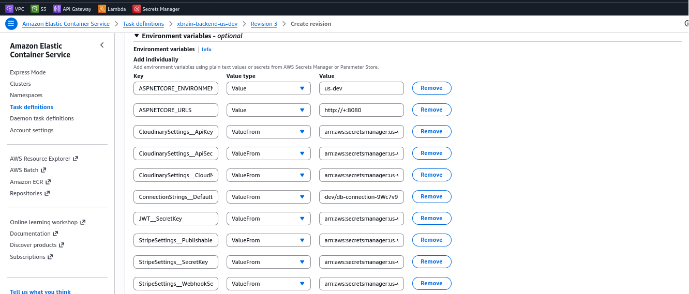
Lambda chat trigger bedrock agent iam policy của nó tụi em sẽ chỉ cấp cho nó invoke tới agent đã tạo, và ở tuần này policy của lambda chat sẽ có thêm policy put metric data 
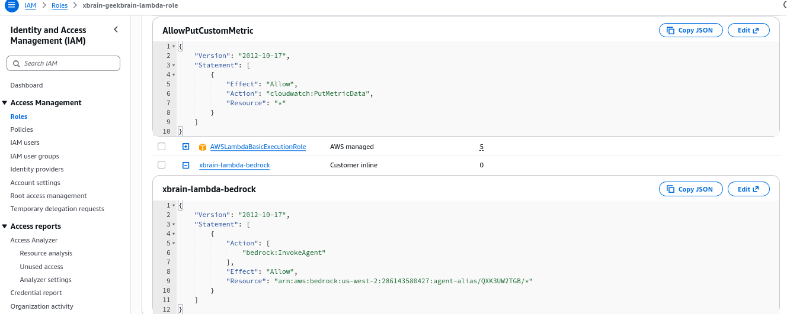

Đó là những gì ở tuần 3 và nó đã được thay đổi gì ở w5-w6 hiện tại.

Ở w5 vừa rồi , phần backup chưa bật backup vault lock nhưng hiện tại thì tụi em bị access denied phần này nên chưa tạo 

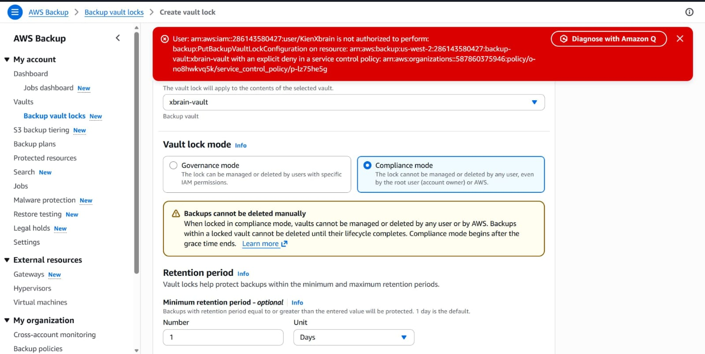
	
Ở phần restore backup w5 vừa rồi khi chạy tụi em chưa chứng minh được dữ liệu thật đã restore chưa nên tụi em bổ sung ảnh tuần này

ảnh efs config gốc, data
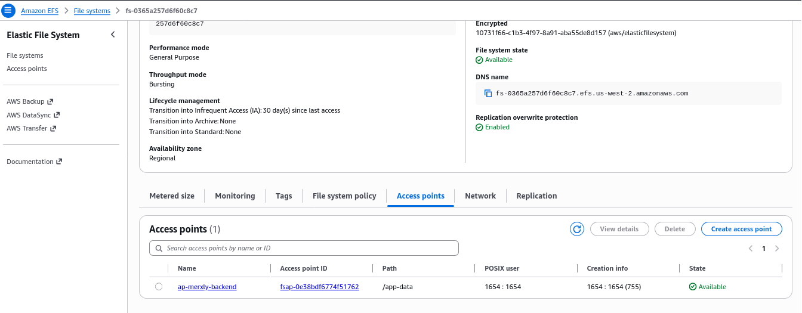
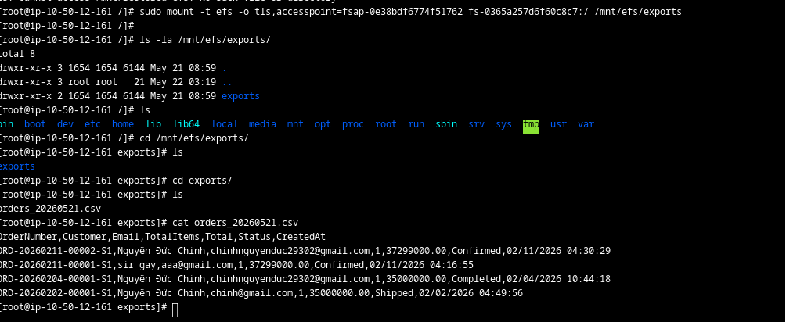

ảnh backup job
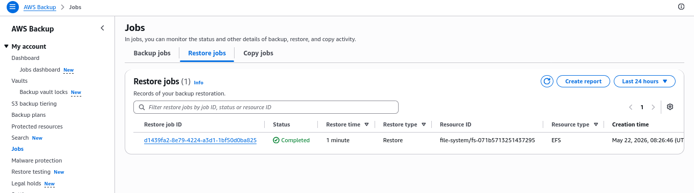

ảnh efs backup, data
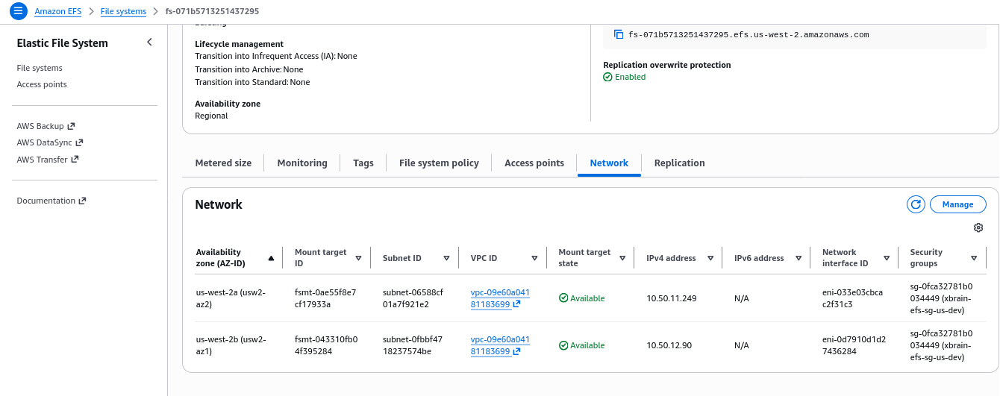
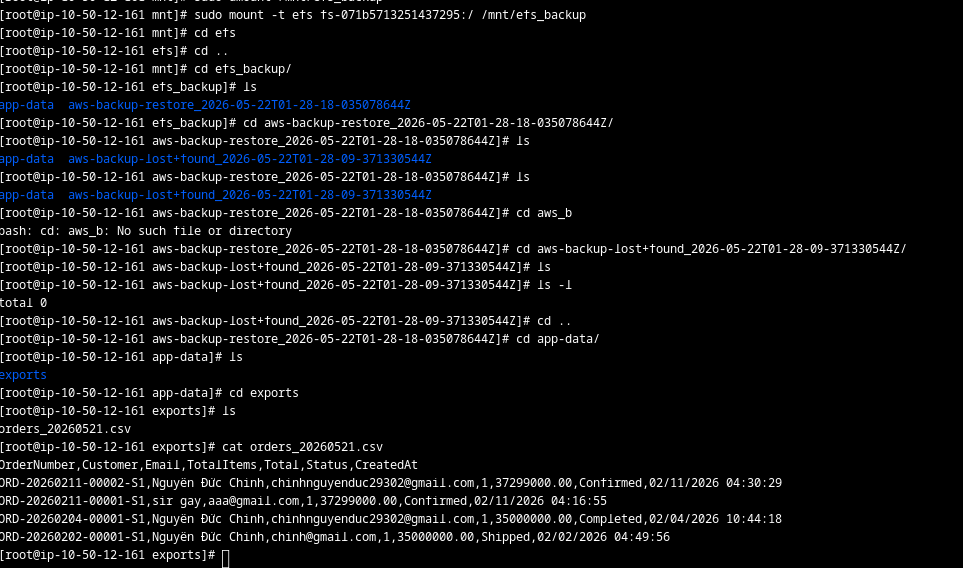

Phần api key api gateway tuần trước tụi em bị lộ ở header, tuần này tụi em đã fix bằng cách cho fe đi tới backend, để backend sử dụng key từ secret manager để gọi tới api gateway và sẽ không bị lộ key như tuần vừa rồi

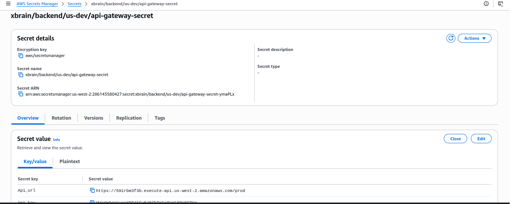

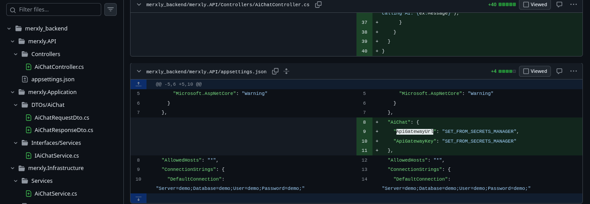
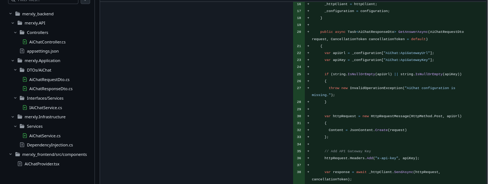
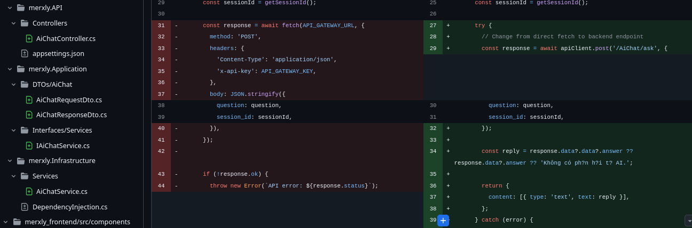

---

## (2) MH-COST-V — Cost Visibility & Attribution

### Task 1: Tagging Strategy & Standardized Tags

#### 1.1. Tagging Strategy Document

| Tag Key       | Purpose                        | Example Value           |
| ------------- | ------------------------------ | ----------------------- |
| `Owner`       | Team/contact responsible       | `team9xbrain@email.com` |
| `Environment` | Deployment stage               | `dev`                   |
| `CostCenter`  | Budget allocation group        | `G9`                    |
| `Application` | Application/project identifier | `Merxly`                |

> **Capitalization Convention:** PascalCase for all tag keys. Enforced via Terraform `default_tags` in `provider.tf` — every resource created by Terraform automatically inherits these 4 tags without manual intervention.

#### 1.2. Global Tags Overview via Tag Editor

<!-- 📸 SCREENSHOT: Chụp AWS Console > Resource Groups > Tag Editor showing tags on all resources -->

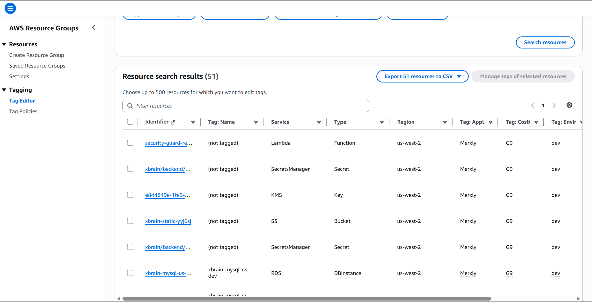

> **Note:** Hình ảnh từ AWS Resource Groups Tag Editor xác nhận có 51 resources trên toàn hệ thống (bao gồm KMS, Lambda, RDS, S3, SecretsManager...) đều được gắn đầy đủ 4 tag chuẩn. Việc này được tự động hóa nhờ cơ chế `default_tags` trong Terraform `provider.tf`.

#### 1.3. Tags on ECS (Cluster + Service + Task Definition)

<!-- 📸 SCREENSHOT: AWS Console > ECS > Cluster hoặc Task Definition > Tab Tags — hiển thị 4 tags -->

> **Note:** ECS Task Definition được cấu hình `tags = var.tags` và ECS Service có `propagate_tags = "SERVICE"` để mọi task auto-scaled đều kế thừa đầy đủ tag.

#### 1.4. Tags on RDS

<!-- 📸 SCREENSHOT: AWS Console > RDS > Database instance > Tab Tags -->

> **Note:** RDS MySQL instance được gắn đầy đủ 4 tag chuẩn + tag `keep=true` để tránh bị Cost Guard Lambda tự động tắt.

#### 1.5. Tags on Lambda Functions

<!-- 📸 SCREENSHOT: AWS Console > Lambda > cost-guard-lambda hoặc security-guard-remediation > Tab Tags -->

> **Note:** Cả 2 Lambda function (Cost Guard và Security Guard) đều được gắn tag thông qua Terraform module.

<!--
### Task 2: Cost Allocation Tags & Cost Explorer

#### 2.1. Cost Allocation Tags Activated

<!-- 📸 SCREENSHOT: AWS Billing Console > Cost Allocation Tags — showing Owner, Application tags activated -->

> **Note:** Tag `Owner` và `Application` đã được kích hoạt trong AWS Billing Console. Lưu ý: AWS cần 24h để bắt đầu hiển thị dữ liệu phân bổ chi phí theo tag.

#### 2.2. Cost Explorer Baseline View

<!-- 📸 SCREENSHOT: AWS Cost Explorer > Filter by Application=Merxly — showing cost breakdown by service -->

> **Note:** Cost Explorer được cấu hình lọc theo tag `Application=Merxly`. Baseline cost breakdown cho thấy phân bổ chi phí theo từng dịch vụ AWS.

#### 2.3. Top 3 Cost Drivers Identified

---
-->

---

## (3) MH-COST-A — Automated Cost Guard

### Task 3: Cost Guard Lambda & IAM Role

#### 3.1. Lambda Function Deployed

<!-- 📸 SCREENSHOT: AWS Lambda Console > Function cost-guard-lambda > Tab Code — showing function overview -->

.png>)

> **Note:** Lambda function `cost-guard-lambda` chạy Python 3.12, quét EC2 và RDS instances. Instances thiếu tag `keep=true` hoặc `Environment=dev` sẽ bị tự động dừng (stop).

#### 3.2. IAM Role — Least-Privilege Policy

<!-- 📸 SCREENSHOT: IAM Console > Role cost-guard-lambda-role > Permissions tab — showing inline policy -->

> **Note:** IAM Role chỉ cấp đúng 5 quyền cần thiết:
>
> - `ec2:DescribeInstances`, `ec2:StopInstances` (scoped to account)
> - `rds:DescribeDBInstances`, `rds:ListTagsForResource`, `rds:StopDBInstance` (scoped to account)
> - `logs:CreateLogStream`, `logs:PutLogEvents` (scoped to specific log group)

#### 3.3. EventBridge Schedule Trigger

<!-- 📸 SCREENSHOT: EventBridge Console > Rules > cost-guard-schedule — showing cron expression -->

> **Note:** EventBridge rule `cost-guard-schedule` chạy theo lịch `rate(1 day)` để tự động quét và dừng tài nguyên lãng phí mỗi ngày.

---

### Task 4: Budget Alert & SNS Notification Chain

#### 4.1. AWS Budgets Configuration

<!-- 📸 SCREENSHOT: AWS Budgets Console > Budget detail — showing $150 daily budget with SNS alert -->

> **Note:** Daily budget $150 USD được cấu hình. Khi chi phí thực tế vượt 80% ngưỡng, alert tự động gửi tới SNS topic → trigger Cost Guard Lambda.

#### 4.2. SNS Topic & Lambda Subscription

<!-- 📸 SCREENSHOT: SNS Console > Topic cost-guard-budget-topic > Subscriptions tab -->

> **Note:** SNS topic `cost-guard-budget-topic` có Lambda subscription. Khi Budgets phát hiện chi phí vượt ngưỡng → SNS publish message → Lambda tự động quét và dừng tài nguyên thừa.

---

### Task 5: Cost Guard Test Evidence

#### 5.1. Manual Invocation & CloudWatch Logs

<!-- 📸 SCREENSHOT: CloudWatch Logs > Log group /aws/lambda/cost-guard-lambda — showing scan results -->

.png>)

> **Note:** Kết quả chạy thử Cost Guard Lambda. Log hiển thị danh sách EC2/RDS instances đã được quét và hành động stop (nếu có) trên các instance không có tag `keep=true`.

#### 5.2. Cost Guard Action Result

<!-- 📸 SCREENSHOT: EC2 Console > Instances — showing stopped EC2 instance from Cost Guard -->

> **Note:** Ảnh minh họa EC2 instance đã bị Cost Guard dừng khi không có tag `keep=true`. Đây là bằng chứng thực tế cho hành động tự động hóa quản lý chi phí.

---

## (4) MH-OBS — Observability

### 4.1. CloudWatch Dashboard (3 Widgets)

<!-- 📸 SCREENSHOT: CloudWatch Console > Dashboards > xbrain-dashboard — showing all 3 widgets -->

> **Note:** Dashboard `Metric` gồm 5 widget:
>
> - **Widget 1 (Custom Metric):** `AgentResponseLatencyMs` — latency Bedrock Agent, publish qua `PutMetricData` (namespace `GeekBrain/AI_Operations`)
> - **Widget 2 (Data tier):** RDS `DatabaseConnections` + `CPUUtilization`
> - **Widget 3 (API tier):** API Gateway `Count` + `4XXError` + `5XXError`
> - **Widget 4 (CWAgent):** `mem_used_percent` — RAM usage trên ECS EC2 host (namespace `CWAgent`)
> - **Widget 5 (Compute tier):** Lambda `Errors` + `Invocations`

### 4.2. CloudWatch Alarm

**Case 1: EC2 high cpu alarm** 
**Mô tả:** EC2 High CPU alarm được sử dụng để phát hiện sớm tình trạng server backend bị quá tải khi lưu lượng truy cập tăng đột biến hoặc ứng dụng xử lý request vượt quá tài nguyên cho phép, từ đó giảm nguy cơ chậm phản hồi và gián đoạn dịch vụ. 

 
 
 
Check case 1:Làm tăng CPU: 
 
Results:  
Action thông báo email. 
 
Check history trạng thái: 
 
 
 
**Case 2: ALB Backend Error Monitoring**  
**Mô tả:** Phát hiện số lượng lỗi HTTP 5XX tăng cao từ backend phía sau Application Load Balancer.  
 
 
**Case 3: ALB-UnHealthyHostCount**  
**mô tả:** Phát hiện target/backend phía sau ALB chuyển sang trạng thái unhealthy hoặc không còn đáp ứng health check.  
 
**Case 4: ECS-RunningTaskCount-Low**
**mô tả:** Phát hiện ECS service chạy thiếu số lượng task yêu cầu, có nguy cơ ảnh hưởng khả dụng dịch vụ.
 
ACtion case 2,3,4:  
 

## BONUS Composite CloudWatch Alarm
**Composite CloudWatch Alarm: Service-Availability-Confirmed** 
**Logic:** Composite alarm xác nhận sự cố availability chỉ khi backend ALB trả nhiều lỗi 5XX đồng thời với target unhealthy hoặc ECS service thiếu running task. 
ALARM("ALB-Target-5XX-High")  
AND   
( 
  ALARM("ALB-UnHealthyHostCount") 
  OR 
  ALARM("ECS-RunningTaskCount-Low") 
) 
**lý do**:Trong hệ thống này, nếu chỉ dùng alarm ALB-Target-5XX-High thì các lỗi 5XX tạm thời cũng có thể gửi cảnh báo dù ECS service vẫn healthy. Để giảm alarm fatigue, composite alarm chỉ trigger khi lỗi 5XX xảy ra đồng thời với: ALB có unhealthy target hoặc ECS thiếu running task. Điều này giúp tránh alert không cần thiết và chỉ cảnh báo khi hệ thống thật sự có sự cố availability.  
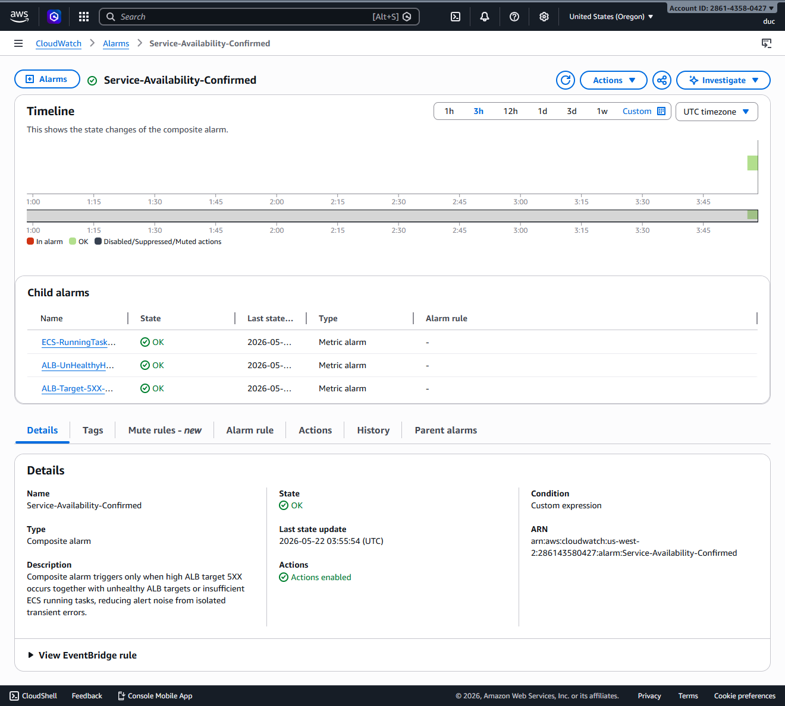 
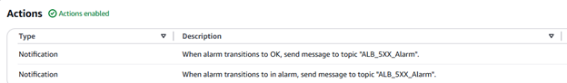 

### 4.3. Log Insights Query
**Queries** 
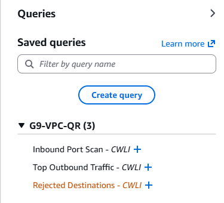 
**Case 1: Inbound Port Scan** 
Mục đích: Detect inbound scanning/reconnaissance vào các port nhạy cảm (SSH, Telnet, RDP, DB, admin port) trong VPC để kiểm tra exposure và validate Security Group/NACL. “Ai đang nhắm vào tôi” 
Kết quả: Có nhiều IP public đang scan Telnet, RDP và admin port vào private IP trong VPC, nhưng đều bị AWS block (REJECT).  
Đề xuất tiếp theo: Kiểm tra lại Security Group/public access và block các IP scan nhiều nếu cần. 
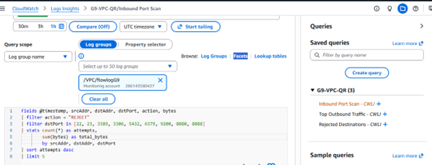 
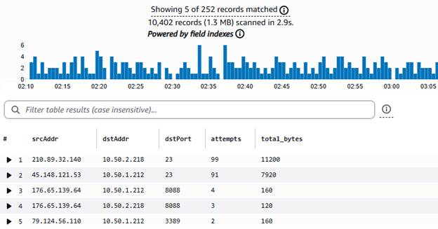 
**case 2: Top Outbound Traffic: Detect outbound traffic lớn/NAT cost**  
Mục đích: Detect outbound traffic lớn từ private subnet ra internet để kiểm tra bất thường và tối ưu NAT Gateway cost.  
Kết quả: Các private IP 10.50.x.x đang gửi nhiều HTTPS traffic (443) ra public IP bên ngoài. Chuẩn đoán là application/API traffic bình thường qua NAT Gateway. 
Đề xuất tiếp theo: Kiểm tra workload nào tạo nhiều outbound traffic nhất để tối ưu NAT cost hoặc phát hiện traffic bất thường. 
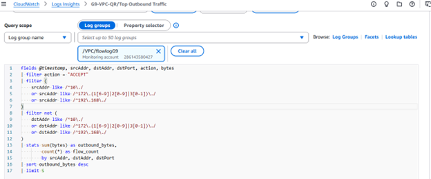 
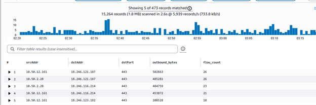 
**Case 3: Rejected Destinations: Detect SG/NACL reject nhiều nhất** 
Mục đích: Detect outbound traffic lớn từ private subnet ra internet để kiểm tra bất thường và tối ưu NAT Gateway cost. “resource nào của tôi bị target nhiều nhất”  
Kết quả: 10.50.2.218:23 và 10.50.1.212:23 bị reject nhiều nhất, cho thấy có nhiều IP bên ngoài đang scan Telnet vào các private IP này. Ngoài ra còn có probe vào port 3389 (RDP).  
Đề xuất tiếp theo: Kiểm tra các instance bị target có đang public ngoài ý muốn không và xác nhận Security Group đang block đúng các port nhạy cảm.  
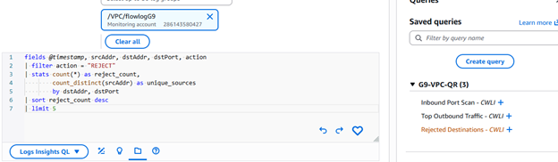 
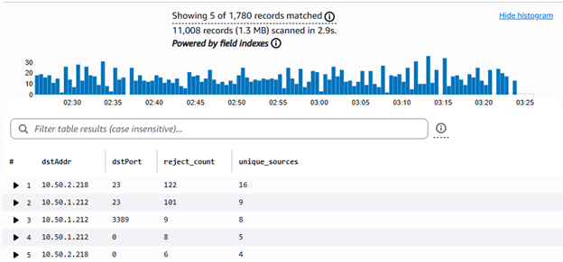 

## (5) MH-SEC — Self-Healing Security Guard

### Task 6: Security Guard Lambda & IAM Role

#### 6.1. Lambda Function Deployed

<!-- 📸 SCREENSHOT: Lambda Console > Function security-guard-remediation > Tab Code — showing function overview with EventBridge trigger visible -->

> **Note:** Lambda function `security-guard-remediation` chạy Python 3.12. Quét tất cả Security Groups, tự động revoke mọi inbound rule mở port 22 (SSH) hoặc 3389 (RDP) từ `0.0.0.0/0` hoặc `::/0`.

#### 6.2. IAM Role — Least-Privilege Policy

<!-- 📸 SCREENSHOT: IAM Console > Role security-guard-role > Permissions tab — showing inline policy -->

> **Note:** IAM Role chỉ cấp đúng 3 quyền cần thiết:
>
> - `ec2:DescribeSecurityGroups` (scan)
> - `ec2:RevokeSecurityGroupIngress` (remediate)
> - `logs:CreateLogStream`, `logs:PutLogEvents` (logging)

#### 6.3. EventBridge Rule — Real-time Trigger

<!-- 📸 SCREENSHOT: EventBridge Console > Rules > security-guard-trigger — showing event pattern for AuthorizeSecurityGroupIngress -->

> **Note:** EventBridge rule lắng nghe event `AuthorizeSecurityGroupIngress` từ `aws.ec2`. Bất kỳ khi nào có người mở port trên Security Group, Lambda được trigger tức thì để kiểm tra và revoke nếu vi phạm.

---

### Task 7: Security Guard Demo — Before/After Evidence

#### 7.1. BEFORE — Mở port 22 (SSH) công khai

<!-- 📸 SCREENSHOT: EC2 Console > Security Groups > sg-xxx > Inbound rules — showing port 22 from 0.0.0.0/0 -->

> **Note:** Cố tình mở port 22 từ `0.0.0.0/0` trên Security Group `xbrain-backend-sg-us-dev` để demo khả năng tự phục hồi của Security Guard.

#### 7.2. CloudWatch Logs — Lambda Detected & Revoked

<!-- 📸 SCREENSHOT: CloudWatch Logs > /aws/lambda/security-guard-remediation — showing "Detect insecure SSH Rule" and "Revoking..." messages -->

> **Note:** CloudWatch Logs ghi nhận Lambda phát hiện rule vi phạm trên `sg-038f55c3b3f175363` và tự động thực hiện revoke. Thời gian phản ứng: < 5 giây kể từ khi port được mở.

#### 7.3. AFTER — Port 22 đã bị revoke tự động

<!-- 📸 SCREENSHOT: EC2 Console > Security Groups > sg-xxx > Inbound rules — showing port 22 removed, only port 8080 remains -->

> **Note:** Sau khi Lambda chạy, port 22 từ `0.0.0.0/0` đã bị xóa hoàn toàn. Security Group chỉ còn lại rule cho port 8080 (backend traffic) — đúng với thiết kế least-privilege.

#### 7.4. CloudTrail — Audit Trail

<!-- 📸 SCREENSHOT: CloudTrail Console > Event history — showing RevokeSecurityGroupIngress event from Lambda role -->

> **Note:** CloudTrail ghi nhận event `RevokeSecurityGroupIngress` được thực hiện bởi IAM Role của Lambda function. Đây là bằng chứng audit trail cho hành động tự phục hồi bảo mật.

#### 7.5. Security Threat & Blast Radius Analysis

- **Misconfiguration Fixed:** Mở cổng quản trị (SSH - port 22 hoặc RDP - port 3389) cho toàn bộ Internet (`0.0.0.0/0`).
- **Security Threat:** Kẻ tấn công có thể rà quét (scan) port và thực hiện tấn công Brute-force/Dictionary attack liên tục để dò mật khẩu, hoặc khai thác lỗ hổng phần mềm SSH chưa được vá.
- **Blast Radius (Hậu quả nếu không remediate):** Nếu bị chiếm quyền điều khiển EC2, kẻ tấn công có thể:
  1. Đánh cắp, phá hoại hoặc tống tiền (ransomware) dữ liệu trên server.
  2. Sử dụng EC2 làm bàn đạp (pivot) lây lan sang các tài nguyên nhạy cảm khác trong Private Subnet (ví dụ: RDS Database).
  3. Bị lợi dụng tài nguyên để đào coin, gây hóa đơn AWS khổng lồ (Cost Impact).

---

### Task 8: Preventive Control — KMS Customer Managed Key

#### 8.1. KMS CMK Created

<!-- 📸 SCREENSHOT: KMS Console > Customer managed keys > xbrain-rds-key — showing key details, tags, and rotation status -->

> **Note:** Customer Managed Key `xbrain-rds-key` được tạo với:
>
> - **Automatic key rotation:** Enabled (xoay khóa hàng năm)
> - **Tags:** Đầy đủ 4 tag chuẩn (Owner, Environment, CostCenter, Application)
> - **Key Policy:** Cho phép `rds.amazonaws.com` sử dụng khóa để mã hóa/giải mã dữ liệu

#### 8.2. RDS Encrypted with CMK

<!-- 📸 SCREENSHOT: RDS Console > Database > Configuration tab — showing KMS key = xbrain-rds-key (not aws/rds) -->

> **Note:** RDS MySQL instance được mã hóa bằng CMK `xbrain-rds-key` thay vì AWS-managed key (`aws/rds`). CMK cho phép kiểm soát truy cập chi tiết hơn, hỗ trợ audit qua CloudTrail, và tự động xoay khóa hàng năm.

#### 8.3. Security-Cost Trade-off Statement

<!-- 📸 SCREENSHOT: CloudTrail Console > Event history > CreateGrant event showing rds.amazonaws.com accessing the CMK -->

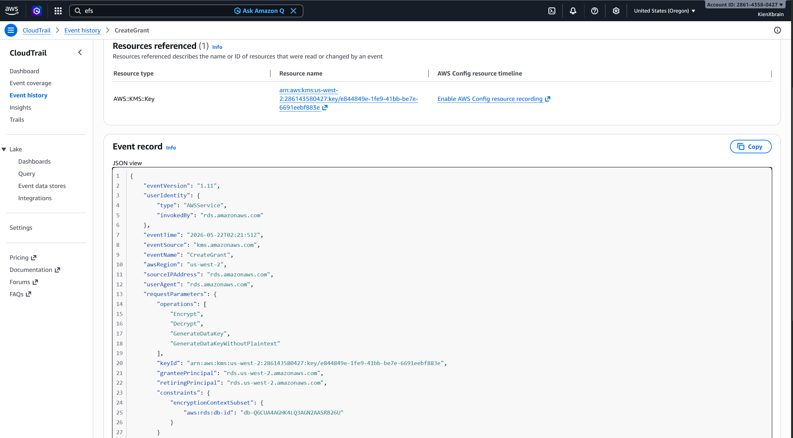

> **Trade-off:** CMK tốn $1/tháng. Justified bởi yêu cầu audit trail — mỗi decrypt event được log kèm IAM principal đã truy cập dữ liệu liên quan. Đồng thời, sự kiện `CreateGrant` trong CloudTrail chứng minh rõ RDS đang xin quyền mã hóa/giải mã thông qua CMK này.

---

## (6) Project Recap

### Architecture Summary

Toàn bộ hạ tầng W6 được quản lý 100% qua Terraform Infrastructure-as-Code:

| Component             | Terraform Module                   | Status        |
| --------------------- | ---------------------------------- | ------------- |
| Cost Tagging          | `provider.tf` (`default_tags`)     | ✅ Applied    |
| Cost Guard Lambda     | `module/CostGuard`                 | ✅ Deployed   |
| Security Guard Lambda | Console (manual)                   | ✅ Deployed   |
| CloudWatch Dashboard  | Console (manual)                   | ✅ Configured |
| KMS CMK               | Console (manual)                   | ✅ Created    |
| Budget Alert          | `module/CostGuard` (Budgets + SNS) | ✅ Active     |

### Git Commit History

- **Terraform Repo:** [G9-X/Terraform-G9](https://github.com/G9-X/Terraform-G9)
- **Application Repo:** [G9-X/Merxly-XB9](https://github.com/G9-X/Merxly-XB9)

---

## (7) Bonus — Stretch Goals (Optional, +0.5 max)

### Bonus 1: gp2 → gp3 EBS Migration & IOPS Documentation (+0.25)

Từ thiết kế hạ tầng Week 5, tụi em đã chủ động lựa chọn sử dụng loại lưu trữ **gp3** thay vì gp2 mặc định cho toàn bộ các instances (bao gồm ECS EC2 instances và RDS MySQL database).

**Lựa chọn cấu hình và sự phù hợp với Workload:**

- **Thiết lập:** Cả ECS instances và RDS database đều được cấu hình dùng volume `storage_type = "gp3"` trực tiếp trong Terraform.
- **IOPS / Throughput:** Tụi em sử dụng cấu hình baseline của gp3: **3,000 IOPS** và **125 MB/s throughput**.
- **Lý do khớp với Workload Profile:** Workload hiện tại của dự án Merxly (môi trường dev/test) có lưu lượng truy cập không quá lớn và không đòi hỏi throughput cực cao liên tục. Baseline 3,000 IOPS là quá dư dả cho các thao tác CRUD cơ bản và test tính năng. Việc chọn gp3 giúp tiết kiệm ngay lập tức **20% chi phí lưu trữ/GB** so với gp2, đồng thời mang lại hiệu năng cao ổn định mà không cần tốn tiền mua thêm burst IOPS.

<!-- 📸 SCREENSHOT: Chụp code Terraform (ví dụ file module/Database_MySQL/main.tf hiển thị storage_type = "gp3") hoặc RDS/EC2 Console showing gp3 type -->

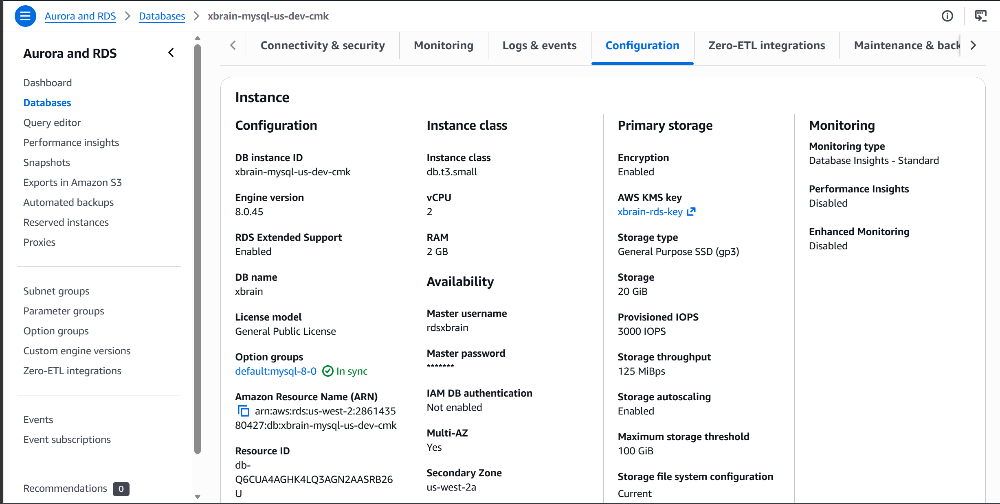

---

### Bonus 2: RI / Savings Plans Break-Even Analysis (+0.25)

#### Current Compute Footprint

- **ECS EC2 Container Instances:** 1× `t3.small` instance running 24/7 in `us-west-2`.
- **On-Demand Rate:** $0.0208/hour per instance.
- **Monthly Spend (On-Demand):** $0.0208 × 730 hours ≈ **$15.18/month**.

#### 1-Year Compute Savings Plan (No Upfront — 28% discount)

- **Savings Plan Rate:** $0.0150/hour per instance.
- **Monthly Commit Spend:** $0.0150 × 730 hours ≈ **$10.95/month**.
- **Monthly Savings:** **$4.23/month**.

#### Break-Even & Recommendation

- **Break-Even Point:** Since this is a 1-year contract, the total annual commitment is **$131.40**. The break-even point against On-Demand occurs at **8.6 months** of continuous usage ($131.40 / $15.18).
- **Justified Deferral Decision:** Vì tài khoản AWS workshop thực chất chỉ được cấp phát và hoạt động **3 ngày mỗi tuần** (bị xóa hoặc khóa vào các ngày còn lại), việc mua Savings Plan kỳ hạn 1 năm sẽ là một quyết định lãng phí tài chính khổng lồ. Sẽ phải trả tiền cho toàn bộ 365 ngày nhưng chỉ thực sự sử dụng hạ tầng chưa tới 150 ngày. Do đó, việc trì hoãn (defer) mua Savings Plan và tiếp tục sử dụng On-Demand kết hợp với Auto Scaling/Cost Guard Lambda là quyết định FinOps tối ưu nhất cho profile của dự án này.

<!-- 📸 SCREENSHOT: (Optional) AWS Pricing Calculator showing t3.small pricing comparison -->

---

### Bonus 3: Terraform IaC for Self-Healing Resources (+0.25)

Toàn bộ **Cost Guard Lambda** được triển khai 100% qua Terraform module `module/CostGuard`:

- **Lambda function** + **IAM Role** (least-privilege)
- **EventBridge Schedule** (daily trigger)
- **SNS Topic** + **Lambda Subscription**
- **AWS Budgets** alert ($150/day → SNS → Lambda)

#### 1. Terraform Validate — Thành công

> **Note:** `terraform validate` chạy thành công sau khi merge PR #24 (fix cost-guard dev targeting).

#### 2. Module CostGuard — main.tf

#### 3. Các file quan trọng khác trong module

**variables.tf**

**outputs.tf**

- **Git Commit Link:** [G9-X/Terraform-G9 — W6 Cost & Security](https://github.com/G9-X/Terraform-G9/commits/main)
